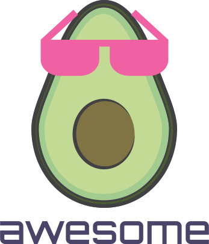

# Awesome Developer Advocacy  

	
	 

	<a href="https://github.com/sindresorhus/awesome/blob/main/awesome.md">What is an awesome list?</a>&nbsp;&nbsp;&nbsp;
	<a href="contributing.md">Contribution guide</a>&nbsp;&nbsp;&nbsp;
	<a href="https://twitter.com/DmitryVinnik">Twitter</a>&nbsp;&nbsp;&nbsp;

## What is Awesome Developer Advocacy?

This project continues a trend started by [Sindre Sorhus](https://github.com/sindresorhus) where he created a project to list useful resources for various topics: NodeJS, JVM, Networking, etc.

Awesome Developer Advocacy is a curated list of **905** resources for anyone interested in DevRel. These links aim to help those who are just starting, planning to get involved, or looking to further their skills in the Developer Advocacy field.

# Table of Contents

-  [Books](#books) (51)
-  [Conferences](#conferences) (16)
-  [Blogs](#blogs) (254)
    -  [Blogging Series](#blogging-series) (87)
    -  [Individual Posts](#individual-posts) (167)
-  [Videos](#videos) (125)
    -  [Video Channels](#video-channels) (27)
    -  [Individual Videos](#individual-videos) (98)
-  [Newsletters](#newsletters) (30)
-  [Podcasts](#podcasts) (49)
    -  [Podcasting Series](#podcasting-series) (40)
    -  [Individual Episodes](#individual-episodes) (9)
-  [Community Reports](#community-reports) (23)
-  [Communities](#communities) (72)
-  [Tools & Services](#tools--services) (124)
-  [Courses & Training](#courses--training) (18)
-  [Guides & Resources](#guides--resources) (143)
-  [Related](#related)

## Books

- "A Friendly Guide to Developer Advocacy"
	-  Author: Linda Ikechukwu
	-  Focus Area: Teaches everything you need to know to become a developer advocate, land a job, and build a thriving career.
	-  [Link](https://link.springer.com/book/9798868824616)

- "API Strategy for Decision Makers"
	-  Author: Mike Amundsen & Derric Gilling
	-  Focus Area: Developer Advocacy
	-  [Link](https://www.oreilly.com/library/view/api-strategy-for/9781492096795/)

- "Ask Your Developer: How to Harness the Power of Software Developers and Win in the 21st Century"
	-  Author: Jeff Lawson
	-  Focus Area: Developer Advocacy
	-  [Amazon Link](https://www.amazon.com/Ask-Your-Developer-Software-Developers/dp/0063018292)

- "Badass: Making Users Awesome"
	-  Author: Kathy Sierra
	-  Focus Area: Developer Advocacy
	-  [Link](https://www.oreilly.com/library/view/badass-making-users/9781491919057/)

- "Building Brand Communities: How Organizations Succeed by Creating Belonging"
	-  Author: Carrie Melissa Jones and Charles H. Vogl
	-  Focus Area: Developer Advocacy
	-  [Amazon Link](https://www.amazon.com/Building-Brand-Communities-Organizations-Belonging/dp/1523086610)

- "Building a StoryBrand: Clarify Your Message So Customers Will Listen"
	-  Author: Donald Miller
	-  Focus Area: Developer Advocacy
	-  [Link](https://www.goodreads.com/book/show/34460583-building-a-storybrand)

- "Confessions of a Public Speaker"
	-  Author: Scott Berkun
	-  Focus Area: Developer Advocacy
	-  [Link](https://www.goodreads.com/book/show/6918930-confessions-of-a-public-speaker)

- "Crafting Docs for Success: An End-to-End Approach to Developer Documentation"
	-  Author: Diana Lakatos
	-  Focus Area: Developer Advocacy
	-  [Amazon Link](https://www.amazon.com/Crafting-Docs-Success-End-End-ebook/dp/B0CD9RHQ4F/)

- "Designing APIs with Swagger and OpenAPI"
	-  Author: Josh Ponelat and Lukas Rosenstock
	-  Focus Area: Developer Advocacy
	-  [Link](https://www.manning.com/books/designing-apis-with-swagger-and-openapi)

- "Designing Web APIs - Chapter 8: Building a Developer Ecosystem Strategy"
	-  Author: Brenda Jin, Saurabh Sahni, Amir Shevat
	-  Focus Area: Developer Advocacy
	-  [Link](https://www.oreilly.com/library/view/designing-web-apis/9781492026914/ch08.html)

- "DevRel Puzzle"
	-  Author: Jorge Barrachina
	-  Focus Area: Developer Advocacy
	-  [Link](https://www.commonroom.io/blog/developer-relations-compensation-and-culture-report-2023/)

- "Developer Marketing Does Not Exist"
	-  Author: Adam DuVander
	-  Focus Area: Developer Advocacy
	-  [Link](https://everydeveloper.com/developer-marketing/book/)

- "Developer Marketing and Relations: The Essential Guide"
	-  Author: SlashData
	-  Focus Area: Developer Advocacy
	-  [Amazon Link](https://www.amazon.com/Developer-Marketing-Relations-Essential-Guide/dp/B08KH3T5TN)

- "Developer Relations Activity Patterns"
	-  Author: Ted Neward, Scott T. McAllister, David Neal, Chris Woodruff
	-  Focus Area: Developer Advocacy
	-  [Link](https://link.springer.com/book/10.1007/979-8-8688-1895-0)

- "Developer Relations for Beginners: What to Know and How to Get Started"
	-  Author: Sarah Lean
	-  Focus Area: Developer Advocacy
	-  [Link](https://leanpub.com/devrelforbeginners)

- "Developer Relations: How to Build and Grow a Successful Developer Relations Program"
	-  Author: Caroline Lewko
	-  Focus Area: Developer Advocacy
	-  [Amazon Link](https://www.amazon.com/Developer-Relations-Build-Successful-Program/dp/1484271637)

- "Developer Relations: How to build and grow a successful developer program"
	-  Author: Caroline Lewko and James Parton
	-  Focus Area: Developer Advocacy
	-  [Link](https://www.devrel.agency/book)

- "Developer, Advocate! Conversations on Turning a Passion for Talking to Developers into a Career"
	-  Author: Geertjan Wielenga
	-  Focus Area: Developer Advocacy
	-  [Amazon Link](https://www.amazon.com/Developer-Advocate-Conversations-turning-passion/dp/1789138744)

- "Docs Like Code: Collaborate and Automate to Improve Technical Documentation"
	-  Author: Anne Gentle
	-  Focus Area: Developer Advocacy
	-  [Amazon Link](https://www.amazon.com/Docs-Like-Code-Collaborate-Documentation-ebook/dp/B0BPN3YYSX/)

- "Docs for Developers: An Engineer's Field Guide to Technical Writing"
	-  Author: Jared Bhatti, Zachary Sarah Corleissen, Jen Lambourne, David Nunez, Heidi Waterhouse
	-  Focus Area: Developer Advocacy
	-  [Amazon Link](https://www.amazon.com/Docs-Developers-Engineers-Field-Technical/dp/1484272161)

- "Docs for Developers: An Engineer’s Field Guide to Technical Writing"
	-  Author: Jared Bhatti, Zachary Sarah Corleissen, Jen Lambourne, David Nunez, and Heidi Waterhouse
	-  Focus Area: Developer Advocacy
	-  [Link](https://www.writethedocs.org/books/#docs-for-developers-an-engineer-s-field-guide-to-technical-writing)

- "Frictionless: How to Outpace Your Competition in the AI Era"
	-  Author: Nicole Forsgren
	-  Focus Area: Developer Advocacy
	-  [Free eBook](https://developerexperiencebook.com/)

- "Getting Started in Developer Relations"
	-  Author: Sam Julien
	-  Focus Area: Developer Advocacy
	-  [Link](https://learn.samjulien.com/getting-started-in-developer-relations)

- "Modern Technical Writing"
	-  Author: Andrew Etter
	-  Focus Area: Developer Advocacy
	-  [Link](https://www.writethedocs.org/books/#modern-technical-writing)

- "Modern Technical Writing: An Introduction to Software Documentation"
	-  Author: Andrew Etter
	-  Focus Area: Developer Advocacy
	-  [Amazon Link](https://www.amazon.com/Modern-Technical-Writing-Introduction-Documentation-ebook/dp/B01A2QL9SS)

- "Orality and Literacy: The Technologizing of the Word"
	-  Author: Walter J. Ong
	-  Focus Area: Developer Advocacy
	-  [Amazon Link](https://www.amazon.com/Orality-Literacy-Technologizing-Word-Interfaces/dp/0415281296)

- "People Powered: How Communities Can Supercharge Your Business, Brand, and Teams"
	-  Author: Jono Bacon
	-  Focus Area: Developer Advocacy
	-  [Link](https://www.jonobacon.com/books/peoplepowered/)

- "Picks & Shovels: Developer Marketing for Startups and Growing Companies"
	-  Author: Strategic Nerds
	-  Focus Area: Developer Advocacy
	-  [Link](https://www.strategicnerds.com/developer-relations)

- "Platform Engineering"
	-  Author: Camille Fournier & Ian Nowland
	-  Focus Area: Developer Advocacy
	-  [Link](https://www.oreilly.com/library/view/platform-engineering/9781098153632/)

- "Presentation Skills for Technical Professionals"
	-  Author: Naomi Karten
	-  Focus Area: A book that provides expert advice and invaluable tips for technical professionals looking to improve their presentation skills.
	-  [Link](https://www.oreilly.com/library/view/presentation-skills-for/9781849281553/)

- "Style: Ten Lessons in Clarity and Grace"
	-  Author: Joseph M. Williams
	-  Focus Area: Developer Advocacy
	-  [Amazon Link](https://www.amazon.com/Style-Ten-Lessons-Clarity-Grace/dp/0321288319)

- "Talk Like TED"
	-  Author: Carmine Gallo
	-  Focus Area: Developer Advocacy
	-  [Link](https://www.goodreads.com/book/show/17910144-talk-like-ted)

- "Team Topologies: Organizing for fast flow of value"
	-  Author: Matthew Skelton and Manuel Pais
	-  Focus Area: Developer Advocacy
	-  [Link](https://teamtopologies.com/)

- "Technical Content Strategy Decoded"
	-  Author: Adam DuVander
	-  Focus Area: Developer Advocacy
	-  [Link](https://www.goodreads.com/en/book/show/61322440)

- "Technical Writing for Developers: Utilizing HTML, JavaScript, Markdown, and GitHub for Writing"
	-  Author: Jim Hall
	-  Focus Area: This guide helps devs utilise common tools like HTML, Markdown and GitHub for document markup as teams shift and technical writing falls onto the coder.
	-  [Link](https://link.springer.com/book/10.1007/979-8-8688-2111-0)

- "Technical Writing for Software Developers"
	-  Author: Chris Chinchilla
	-  Focus Area: Developer Advocacy
	-  [Link](https://www.oreilly.com/library/view/technical-writing-for/9781835080405/)

- "The Art of Community: Building the New Age of Participation"
	-  Author: Jono Bacon
	-  Focus Area: Developer Advocacy
	-  [Link](https://www.jonobacon.com/books/artofcommunity/)

- "The Art of Community: Seven Principles for Belonging"
	-  Author: Charles H. Vogl
	-  Focus Area: Developer Advocacy
	-  [Amazon Link](https://www.amazon.com/Art-Community-Seven-Principles-Belonging/dp/1626568413)

- "The Business Value of Developer Relations"
	-  Author: Mary Thengvall
	-  Focus Area: Developer Advocacy
	-  [Link](https://www.marythengvall.com/devrelbook)

- "The Business Value of Developer Relations: How and Why Technical Communities Are Key To Your Success"
	-  Author: Mary Thengvall
	-  Focus Area: Developer Advocacy
	-  [Amazon Link](https://www.amazon.com/Business-Value-Developer-Relations-Communities/dp/1484237471)

- "The Design of Web APIs"
	-  Author: Arnaud Lauret
	-  Focus Area: Developer Advocacy
	-  [Link](https://www.manning.com/books/the-design-of-web-apis)

- "The Developer Advocacy Handbook"
	-  Author: Christian Heilmann
	-  Focus Area: Developer Advocacy
	-  [Link](https://developer-advocacy.com/)

- "The Developer Experience Book"
	-  Author: Addy Osmani
	-  Focus Area: Developer Advocacy
	-  [Link](https://addyosmani.com/dx/)

- "The Developer Productivity Engineering Handbook"
	-  Author: Gradle
	-  Focus Area: Developer Advocacy
	-  [Link](https://gradle.com/developer-productivity-engineering/handbook/)

- "The Developer's Guide to Content Creation"
	-  Author: Stephanie Morillo
	-  Focus Area: Developer Advocacy
	-  [Link](https://www.goodreads.com/book/show/50996057-the-developer-s-guide-to-content-creation)

- "The Feedback Loop"
	-  Author: Sam Julien
	-  Focus Area: Developer Advocacy
	-  [Link](https://www.samjulien.com/feedback-loop)

- "The Modern Developer Experience"
	-  Author: Steve Buchanan
	-  Focus Area: Developer Advocacy
	-  [Link](https://www.oreilly.com/library/view/the-modern-developer/9781098169701/)

- "The Official TED Guide to Public Speaking"
	-  Author: Chris Anderson
	-  Focus Area: Developer Advocacy
	-  [Link](https://www.ted.com/read/ted-talks-the-official-ted-guide-to-public-speaking)

- "The Product is Docs"
	-  Author: Christopher Gales, The Splunk Documentation Team
	-  Focus Area: Developer Advocacy
	-  [Link](https://www.writethedocs.org/books/#the-product-is-docs)

- "The Visual Display of Quantitative Information"
	-  Author: Edward R. Tufte
	-  Focus Area: Developer Advocacy
	-  [Link](https://www.edwardtufte.com/book/the-visual-display-of-quantitative-information/)

- "Working in Public: The Making and Maintenance of Open Source Software"
	-  Author: Nadia Eghbal
	-  Focus Area: Developer Advocacy
	-  [Link](https://www.goodreads.com/book/show/54140336-working-in-public)

## Conferences

These conferences are great resources for both in-person learning and as a place to watch videos from the events' past editions.

- [All Things Open](https://2025.allthingsopen.org/)
- [CMX Summit](https://cmxhub.com/summit/)
- [Cloud Native Developer Experiences in 2025](https://speakerdeck.com/salaboy/cloud-native-developer-experiences-in-2025)
- [DPE Summit](https://dpe.org/)
- [DevConf.US 2026](https://www.devconf.info/us/)
- [DevRel Conf - Russia](https://devrelconf.ru/5/)
- [DevRel Summit](http://www.devrelsummit.com/)
- [DevRel/Asia](https://devrel.asia)
- [DevRelCon](https://devrelcon.dev)
- [DevRelCon San Francisco 2019](https://developerrelations.com/devrelcon/devrelcon-san-francisco-2019/)
- [Developer Relations Conference](https://evansdata.com/drc/2020/)
- [DeveloperWeek](https://www.developerweek.com/)
- [MEGAComm](https://www.fluidtopics.com/blog/events/technical-communications-conferences-in-2025/)
- [Open Source Summit](https://events.linuxfoundation.org/open-source-summit-north-america/)
- [The Past, Present, and Future of RingCentral Developers 🚀 Join Our Developer Meetup and Learn More!](https://community.ringcentral.com/developer-platform-apis-integrations-5/the-past-present-and-future-of-ringcentral-developers-join-our-developer-meetup-and-learn-more-11705)
- [apidays](https://www.apidays.global/)

## Blogs

### Blogging Series

These are the blogs that have been publishing DevRel content continuously rather than as a single post.

- [#TCCS 13: What is Internal Developer Advocacy](https://www.everythingtechnicalwriting.com/internal-developer-advocacy/)
- [10 Engaging SaaS Changelog Examples to Inspire You](https://www.getbeamer.com/blog/10-engaging-saas-changelog-examples-to-inspire-you)
- [2025 Developer Tool Trends: What Marketers Need to Know](https://business.daily.dev/resources/2025-developer-tool-trends-what-marketers-need-to-know/)
- [A Day in the Life of a Developer Advocate](https://www.redpanda.com/blog/developer-advocate-remote-christina-lin)
- [API Developer Experience (DX) Resources | API Guide](https://www.moesif.com/blog/api-guide/api-developer-experience/)
- [API Evangelism and API Advocacy: Is There A Difference?](https://nordicapis.com/api-evangelism-and-api-advocacy-is-there-a-difference/)
- [Android Developers Blog](https://android-developers.googleblog.com/)
- [Angie Jones' Blog](https://angiejones.tech/)
- [Best Community Engagement Strategies](https://www.advocu.com/post/best-community-engagement-strategies)
- [Best Practices for Managing and Leading a Team of Developer Advocates](https://www.advocu.com/post/best-practices-for-managing-and-leading-a-team-of-developer-advocates)
- [Best Practices in API Design](https://swagger.io/resources/articles/best-practices-in-api-design/)
- [Black Girl Bytes by Rizèl Scarlett](https://dev.to/blackgirlbytes)
- [Bolaji Ayodeji's Blog](https://blog.bolajiayodeji.com/)
- [Building Internal Developer Platforms That Actually Work](https://www.axelerant.com/blog/building-internal-developer-platforms)
- [Chris Reddington's DevRel Blog](https://chrisreddington.com/blog/)
- [Climbing the DevRel Career Ladder](https://www.everythingtechnicalwriting.com/climbing-the-devrel-career-ladder/)
- [Community Gamification: A Step-by-Step Implementation Guide](https://www.gainsight.com/blog/community-gamification/)
- [Community Guidelines That Actually Work: A Strategic Framework](https://bevy.com/b/blog/community-guidelines-that-actually-work-a-strategic-framework)
- [Community Strategy: The Three Level Framework](https://www.cmxhub.com/blog/the-three-level-strategy-framework)
- [DX Blog by GetDX](https://getdx.com/blog/)
- [DevRel Foundation Blog](https://dev-rel.org/blog/)
- [DevRel Management and Leadership: Guidance, Skill Development, and Book Recommendations](https://avocadobytes.substack.com/p/devrel-management-and-leadership)
- [DevRel Resources](https://github.com/odyslam/devrel-resources)
- [DevRel Weekly](https://devrelweekly.com/)
- [DevRel is More Than Marketing. It's Co-creation.](https://chrisreddington.com/blog/devrel-value-co-creation-not-marketing/)
- [DevRel.co](https://devrel.co/)
- [DevRel.net](https://developerrelations.com/)
- [DevRel/Engineering Leadership Resources](https://momack.medium.com/engineering-leadership-resources-2fdc6ea75fa3)
- [Developer Advocate: Complete Career Guide for DevRel Professionals](https://www.reo.dev/blog/developer-advocate-guide-devrel)
- [Developer Awards](https://create.roblox.com/docs/creator-programs/developer-awards)
- [Developer Engagement Strategies: Behind the Scenes with PayPal's DevRel Expert Christina Monti](https://www.advocu.com/post/developer-engagement-strategies-behind-the-scenes-with-paypals-devrel-expert-christina-monti)
- [Developer Experience (DevEx) in 2026](https://dev.to/austinwdigital/developer-experience-devex-in-2026-the-real-competitive-advantage-2996)
- [Developer Experience: Prerequisite and Product of DevRel](https://chrisreddington.com/blog/devrel-developer-experience/)
- [DeveloperRelations.com](https://developerrelations.com)
- [Dillion Megida's Blog](https://dillionmegida.com/blog/)
- [Driving Developer Adoption in 2025](https://instruqt.com/blog/driving-developer-adoption-in-2025-insights-strategies-and-expert-advice)
- [Erin Mikail Staples' Website](https://www.erinmikailstaples.com/)
- [Everything Technical Writing](https://www.everythingtechnicalwriting.com/)
- [Evolution and Value of Developer Relations](https://jimmysong.io/blog/devrel-role-evolution-and-value/)
- [Exploring Salaries in DevRel Careers: Research](https://develocity.io/exploring-salaries-in-developer-relations/)
- [Guide to Building Developer Advocacy Communities](https://business.daily.dev/resources/developer-advocacy-communities-guide/)
- [HeavyBit Industries](https://www.heavybit.com/library)
- [How Publishing a Changelog Can Help You Retain More Users](https://www.getbeamer.com/blog/how-publishing-a-changelog-can-help-you-retain-more-users)
- [How to Apply for Your First DevRel Job](https://developerrelations.com/origin-stories/phil-leggetter/)
- [How to Build a Developer Community](https://reimer.me/blog/how-to-build-a-developer-community)
- [How to Build a Thriving Developer Community in 2025](https://draft.dev/learn/cultivating-a-thriving-developer-community)
- [How to build a better developer experience](https://github.blog/2024-01-23-good-devex-increases-productivity/)
- [Internal Developer Advocacy: What Should You Do Next?](https://thenewstack.io/internal-developer-advocacy-what-should-you-do-next/)
- [Internal Developer Platform [Benefits + Best Practices]](https://www.atlassian.com/developer-experience/internal-developer-platform)
- [Intuitive API Developer Experience with Nolan di Mare Sullivan from Speakeasy](https://treblle.com/blog/intuitive-api-developer-experience)
- [James Q. Quick's Website](https://jamesqquick.com/)
- [Learning About Developer Relations – All Blog Posts From 2020](https://maxkatz.org/2020/12/18/learn-about-developer-relations-all-blog-posts-from-2020/)
- [Level up your developer experience: Five practical strategies for engineering teams](https://www.thoughtworks.com/insights/blog/engineering-effectiveness/level-up-developer-experience-five-practical-strategies-engineering-teams)
- [Mary Thengvall's Blog](https://www.marythengvall.com/blog/category/DevRel)
- [Max Katz's Blog](https://maxkatz.org/)
- [Measuring the Impact of Developer Relations on Revenue](https://jmeiss.me/posts/measuring-devrel-impact-on-revenue/)
- [Minko Gechev's Blog](https://blog.mgechev.com/)
- [My first year as a Developer Advocate](https://patloeber.com/first-year-developer-advocate/)
- [Navigating Your First Year as a Developer Advocate](https://medium.com/@Anita-ihuman/navigating-your-first-year-as-a-developer-advocate-for-a-startup-9445516df46c)
- [Orbit: DevRel Tool - Blog](https://github.com/orbit-love/orbit-model)
- [ProProfs Blog](https://www.proprofs.com/blog/)
- [ShiftMag - Insightful engineering content & community](https://shiftmag.dev/?utm_source=newslepear.beehiiv.com&utm_medium=referral&utm_campaign=141-how-to-get-your-engineers-to-blog-executive-dinners-and-a-benchmarking-ad-campaign-from-clickhouse)
- [Specialization and Career Paths for Developer Relations](https://vera-tiago.medium.com/specialization-and-career-paths-for-developer-relations-b64e16a26f45)
- [Stephanie Morillo's Content](https://dev.to/radiomorillo)
- [StephanieMorillo's Blog](https://www.stephaniemorillo.co/links)
- [Steven Cooper's Website](http://www.developersteve.com/)
- [Ted Spence's Blog](https://tedspence.com/)
- [The Anatomy of a Successful Developer Advocate Program: Empowering Your Community](https://www.doc-e.ai/post/the-anatomy-of-a-successful-developer-advocate-program-empowering-your-community)
- [The Complete Guide to Building and Growing a Vibrant Developer Community](https://www.advocu.com/post/the-complete-guide-to-building-and-growing-a-vibrant-developer-community)
- [The DevRel Digest February 2025: DevRel You Should Know for 2025](https://dev.to/lizzzzz/the-devrel-digest-february-2025-devrel-you-should-know-for-2025-4753)
- [The Hard Parts of Developer Advocacy (For Me)](https://dev.to/blackgirlbytes/the-hard-parts-of-developer-advocacy-for-me-530h)
- [The Ultimate Guide to Writing Technical Blog Posts](https://dev.to/blackgirlbytes/the-ultimate-guide-to-writing-technical-blog-posts-5464)
- [The blog outline that beats all other blog outlines (for me).](https://www.erinmikailstaples.com/the-blog-outline-that-beats-all-other-blog-outlines/)
- [Top 10 Definitions of Developer Relations](https://dev-rel.org/blog/2025-08-18-top-10-definitions-of-devrel)
- [Top 100 Software Testing Blogs and Websites To Follow](https://blog.feedspot.com/software_testing_blogs/)
- [Voxgig DevRel Insights](https://voxgig.substack.com/)
- [Web API Design Best Practices](https://learn.microsoft.com/en-us/azure/architecture/best-practices/api-design)
- [Wesley Faulkner's Website](https://wesleyfaulkner.com/)
- [What Are Breaking Changes?](https://carlosschults.net/en/what-are-breaking-changes)
- [What Goes Into Developer Incentive Programs?](https://x-team.com/magazine/developers-incentive-plans)
- [What I've Learned from 6 Years as a Developer Advocate](https://nathanpeck.com/things-learned-from-six-years-developer-advocacy/)
- [What Is Developer Advocacy? (2025 Edition)](https://ashley.dev/posts/what-is-developer-advocacy)
- [What is an internal developer platform?](https://cloud.google.com/discover/what-is-an-internal-developer-platform)
- [What makes a team effective at Google](https://www.thinkwithgoogle.com/intl/en-emea/consumer-insights/consumer-trends/five-dynamics-effective-team/)
- [Why Your API Needs a Dedicated Developer Experience Team](https://nordicapis.com/why-your-api-needs-a-dedicated-developer-experience-team/)
- [Why care about the developer experience?](https://seanfalconer.medium.com/why-care-about-the-developer-experience-b2907a639ac3)

### Individual Posts

These are one-off blog posts on topics related to the DevRel.

- [10 Strategies to Build a Thriving Developer Community](https://daily.dev/blog/10-strategies-to-build-a-thriving-developer-community/)
    -  Author: Nimrod Kramer

- [10 ways to build a developer community](https://www.apideck.com/blog/ten-ways-to-build-a-developer-community)
    -  Author: Jake Prins

- [13 Best OpenAPI Documentation Tools for 2026](https://treblle.com/blog/best-openapi-documentation-tools)
    -  Author: Treblle

- [2025 State of the API Report](https://www.postman.com/state-of-api/2025/)
    -  Author: Postman

- [30+ Public Speaking Tips for Developers](https://www.outsystems.com/blog/posts/public-speaking-tips-for-developers/)
    -  Author: Ana Tavares

- [4 Keys 2 Fun: Nicole Lazzaro's Game Design Framework (Part 1 of 4)](https://yukaichou.com/behavioral-design/4-keys-2-fun-part-1-4/)
    -  Author: Yu-kai Chou

- [5 AI-Powered Developer Tools Changing the Way We Work in 2025](https://dev.to/outerbase/5-ai-powered-developer-tools-changing-the-way-we-work-in-2025-17ff)
    -  Author: brandon

- [5 Biggest DevRel Challenges (and how to mitigate them)](https://blog.vanillaforums.com/5-biggest-devrel-challenges-and-how-to-mitigate-them)
    -  Author: Mary Thengvall

- [5 Easy Ways to Recognize Who Your Developer Super Fans Are](https://dev.to/tessak22/5-easy-ways-to-recognize-who-your-developer-super-fans-are-2fb5)
    -  Author: Tessa Kriesel

- [7 Tips for Breaking Into DevRel](https://dev.to/dabit3/7-tips-for-breaking-into-devrel-7jk)
    -  Author: Nader Dabit

- [7 things that look like DevRel but aren’t](https://www.linkedin.com/posts/marcosplacona_7-things-that-look-like-devrel-but-arent-activity-7400278074610831361-9ZRZ/?utm_source=share&utm_medium=member_ios&rcm=ACoAAA6PPusBHGh3FZIjVWx49BUzJv6Bq6AODbE)
    -  Author: Marcos Placona

- [7 tips to launch a career as a developer advocate](https://dev.to/sidneyallen/7-tips-to-launch-a-career-as-a-developer-advocate-4a0l)
    -  Author: Sidney Maestre

- [9 signs your marketing team is broken](https://www.optimizely.com/insights/blog/unaligned-marketing-team/)
    -  Author: Leah Messenger

- [A Guide to Public Speaking For Software Engineers](https://www.wearedevelopers.com/en/magazine/324/public-speaking-for-software-engineers)
    -  Author: Jordan Cutler

- [A Guide to the 6 Open Source Governance Models](https://scantist.com/resources/blogs/a-guide-to-the-6-open-source-governance-models)
    -  Author: Steve Cooper

- [A fresher’s guide to DevRel](https://medium.com/hackernoon/a-freshers-guide-to-devrel-10f0d814111e)
    -  Author: Srushtika Neelakantam

- [AARRR Metrics](https://www.slideshare.net/dmc500hats/startup-metrics-for-pirates-long-version)
    -  Author: Dave McClure

- [API Reliability Report 2026: Uptime Patterns Across 215+ Services](https://nordicapis.com/api-reliability-report-2026-uptime-patterns-across-215-services/)
    -  Author: Shibley Burnett

- [Acing the DevRel Interview](https://dev.to/thagomizer/acing-the-devrel-interview-115p)
    -  Author: Aja Hammerly

- [Announcing our Developer Journey Map FigJam Template](https://www.devrel.agency/post/figjamtemplate)
    -  Author: DevRel.Agency

- [Avoiding the DevRel ROI Trap with Better Strategic Alignment](https://petrsvihlik.medium.com/avoiding-the-devrel-roi-trap-with-better-strategic-alignment-bcdb6e2a717d)
    -  Author: Petr Švihlík

- [Back to Basics: How to DevRel without Travel](https://dev.to/jesswest/back-to-basics-how-to-devrel-without-travel-4l7b)
    -  Author: Jess West

- [Best Pitches/Demos of All Time](https://dx.tips/pitches)
    -  Author: Shawn \

- [Beyond the Hype: 5 Takeaways on the Future of Building with AI | Wizeline](https://www.wizeline.ai/beyond-the-hype-5-takeaways-on-the-future-of-building-with-ai/?utm_source=linkedin&utm_medium=social-organic&utm_campaign=beyond-the-hype-five-takeaways-on-the-ai-blog)
    -  Author: Andy Eyherabide

- [Building Your Internal Army — DevRelCon London Follow Up](https://dev.to/missamarakay/building-your-internal-armydevrelcon-london-follow-up-42cf)
    -  Author: Amara Graham

- [CRIBS: My Writing Feedback Formula](https://perell.com/note/cribs-my-writing-feedback-formula/)
    -  Author: David Perell

- [Churn is the quiet SaaS killer](https://www.ben-cotton.com/blog/churn-is-the-quiet-saas-killer)
    -  Author: Ben Cotton

- [Community Engagement: Key for Developers](https://daily.dev/blog/community-engagement-key-for-developers/)
    -  Author: Nimrod Kramer

- [Company Context: The Conditions That Shape DevRel Strategy](https://chrisreddington.com/blog/devrel-company-context-lifecycle/)
    -  Author: Chris Reddington

- [Consistency, Persistence and Feedback: Francesco Ciulla on the Essential Aspects of Content Creation](https://www.advocu.com/post/consistency-persistence-and-feedback-francesco-ciulla-on-the-essential-aspects-of-content-creation)
    -  Author: Maria Kaźmierczyk

- [Content Strategy for DevRel Teams: A Primer](https://dev.to/radiomorillo/content-strategy-for-devrel-teams-a-primer-fjp)
    -  Author: Stephanie Morillo

- [Creating effective technical documentation](https://developer.mozilla.org/en-US/blog/technical-writing/)
    -  Author: Dipika Bhattacharya

- [Customer Experience: The Reliability metric that matters](https://thereliabilityengineering.substack.com/p/customer-experience-the-reliability)
    -  Author: Spiros Economakis

- [DORA (DevOps Research and Assessment)](https://dora.dev/)
    -  Author: Nicole Forsgren, Jez Humble, and Gene Kim

- [Decoding 2024: Insights from Developer Relations Leaders](https://www.devrel.agency/post/decoding-2024-insights-from-developer-relations-leaders)
    -  Author: DevRel.Agency

- [Decoding Developer Relations in a Blog](https://dev.to/manbir/decoding-developer-relations-in-a-blog-5823)
    -  Author: Manbir Singh Marwah

- [Defining Developer Relations](https://www.leggetter.co.uk/2016/02/03/defining-developer-relations.html)
    -  Author: Phil Leggetter

- [DevRel Engineer One: Building a Developer Relations Team from The Ground Up](https://www.freecodecamp.org/news/devrel-engineer-one-building-a-developer-relations-team-from-the-ground-up/)
    -  Author: Dave Nugent

- [DevRel Thoughts, Observations, & Ideas](https://dev.to/adron/devrel-thoughts-observations-ideas-5d32)
    -  Author: Adron Hall

- [DevRel Uni Blog](https://medium.com/@devreluni)
    -  Author: DevRel Uni

- [DevRel Without Physical Conferences](https://dev.to/bengreenberg/devrel-without-physical-conferences-1c7)
    -  Author: Ben Greenberg

- [DevRel and community building with the Golden Ratio](https://dev.to/hayleydenb/devrel-and-community-building-with-the-golden-ratio-27mh)
    -  Author: Hayley Denbraver

- [DevRel is Unbelievably Back](https://scalingdevtools.com/podcast/topics/devrel)
    -  Author: Shawn Wang (swyx)

- [DevRel is like coffee.. and other profundities.](https://medium.com/@jeremymeiss/devrel-is-like-coffee-b3c461de15db)
    -  Author: Jeremy Meiss

- [DevRel metrics and why they matter](https://seanfalconer.medium.com/devrel-metrics-and-why-they-matter-224563a4aa2d)
    -  Author: Sean Falconer

- [DevRel: The basics.](https://dev.to/abacatedevrel/devrel-the-basics-j3o)
    -  Author: Pachi Carlson

- [Developer Advocacy: Frequently Asked Questions](https://dev.to/di/developer-advocacy-frequently-asked-questions-577k)
    -  Author: Dustin Ingram

- [Developer Advocates — DevRelCarousels #3](https://dev.to/yashovardhan/developer-advocates-devrelcarousels-3-47ih)
    -  Author: Yashovardhan Agrawal

- [Developer Communities and Why Your Company Should Care](https://dev.to/jerdog/developer-communities-and-why-your-company-should-care-2b79)
    -  Author: Jeremy Meiss

- [Developer Content Strategies That Work (and Scale)](https://draft.dev/learn/developer-content-strategies-that-work-and-scale)
    -  Author: Karl Hughes

- [Developer Evangelism And Coding Jokes With Steven Cooper](https://www.samjarman.co.nz/blog/developersteve)
    -  Author: Sam Jarman

- [Developer Evangelists - DevRelCarousels #4](https://dev.to/yashovardhan/developer-evangelists-devrelcarousels-4-478e)
    -  Author: Yashovardhan Agrawal

- [Developer Relations + Product - DevRelCarousels #5](https://dev.to/yashovardhan/developer-relations-product-devrelcarousels-5-2p0m)
    -  Author: Yashovardhan Agrawal

- [Developer Relations Career Guide: Skills, Path & Insights 2025](https://draft.dev/learn/developer-relations-career-insights-from-7-industry-leaders)
    -  Author: Karl Hughes

- [Developer Relations at Camunda - 2018 Recap](https://berndruecker.io/developer-relations-at-camunda-2018-recap/)
    -  Author: Bernd Ruecker

- [Developer Relations: A Five-Level Maturity Model](https://softwareas.com/developer-relations-a-five-level-maturity-model/)
    -  Author: Michael Mahemoff

- [Developer Relations: online events and content series](https://maxkatz.org/2020/04/17/developer-relations-online-events-and-content-series/)
    -  Author: Max Katz

- [Developer marketing KPIs are different from DevRel KPIs](https://dev.to/slashdatahq/developer-marketing-kpis-are-different-from-devrel-kpis-3i8l)
    -  Author: SlashData

- [Developer-First GTM Strategy: How to Win with APIs](https://upgrowth.in/gtm-strategy-for-api-and-developer-products/)
    -  Author: Amol Ghemud

- [Effective Developer Advocacy for Highly-Technical Projects](https://dev.to/drnugent/effective-developer-advocacy-for-highly-technical-projects-dl8)
    -  Author: Chris Trag

- [Essential CLI/TUI Tools for Developers](https://www.freecodecamp.org/news/essential-cli-tui-tools-for-developers/)
    -  Author: Alex Pliutau

- [First DevRel Hiring Process](https://dx.tips/first-devrel-hire)
    -  Author: Shawn \

- [Fly Less, Write More: the future of Developer Relations, and maybe, well, everything else](https://redmonk.com/jgovernor/2020/04/)
    -  Author: James Governor

- [Following Cooking Recipes Makes You a Clearer Writer](https://dev.to/missamarakay/following-cooking-recipes-makes-you-a-clearer-writer-460a)
    -  Author: Amara Graham

- [From Staff Technical Writer to Developer Advocate; Read Amruta Ranade’s story](https://www.everythingtechnicalwriting.com/from-staff-technical-writer-to-developer-advocate-read-amruta-ranades-story/)
    -  Author: Amruta Ranade

- [Getting Through Awkwardness in Networking](https://leaddev.com/personal-development/getting-through-awkwardness-networking)
    -  Author: Wesley Faulkner

- [GitHub Changelog](https://github.blog/changelog)
    -  Author: GitHub

- [Heart or Mind? Community or Business? The DevRel Paradox](https://dev.to/akhilsharma_10270)
    -  Author: Akhil Sharma

- [Hello, I am a Developer Advocate](https://medium.com/@joelmarcey/hello-i-am-a-developer-advocate-ff7db13058c7)
    -  Author: Joel Marcey

- [How AI is changing developer relations](https://medium.com/@jkim_tran/how-ai-is-changing-developer-relations-79aecffe638e)
    -  Author: Jennifer Tran

- [How AI is shaping the future of developer relations and developer workflows](https://allthingsopen.org/articles/ai-shapes-future-developer-relations-workflows)
    -  Author: ATO Team

- [How Community Builders Can Bring Existing Offline Communities Online](https://dev.to/yashrajnayak/how-community-builders-can-bring-existing-offline-communities-online-5478)
    -  Author: Yashraj Nayak

- [How I Write Online Articles](https://johnpapa.net/how-i-write-online-articles/)
    -  Author: John Papa

- [How Users Read on the Web](https://www.nngroup.com/articles/how-users-read-on-the-web/)
    -  Author: Jakob Nielsen

- [How and why I use online alpha-readers while writing novels.](https://maryrobinettekowal.com/journal/how-and-why-i-use-online-alpha-readers-while-writing-novels/)
    -  Author: Mary Robinette Kowal

- [How to Build a Thriving Open Source Community](https://www.commonroom.io/blog/five-steps-for-building-a-thriving-open-source-community/)
    -  Author: Jono Bacon

- [How to Measure ROI on Developer Marketing Campaigns](https://business.daily.dev/resources/how-to-measure-roi-on-developer-marketing-campaigns/)
    -  Author: Alex Carter

- [How to Prove DevRel ROI: Metrics That Matter](https://blog.stateshift.com/devrel-roi-metrics-how-to-measure-communitys-business-value/)
    -  Author: Mindy Faieta

- [How to Write Technical Tutorials That Developers Actually Use](https://draft.dev/learn/great-technical-tutorials-address-the-why-and-how)
    -  Author: Karl Hughes

- [How to accelerate developer onboarding (and why it matters)](https://about.gitlab.com/the-source/platform/how-to-accelerate-developer-onboarding-and-why-it-matters/)
    -  Author: George Kichukov

- [How to create developer content that actually gets read](https://allthingsopen.org/articles/how-to-create-developer-content)
    -  Author: Jen Wike Huger

- [How to explain object-oriented programming concepts to a 6-year-old](https://medium.com/free-code-camp/how-to-explain-object-oriented-programming-concepts-to-a-6-year-old-21bb035f7260)
    -  Author: Alexander Petkov

- [How to measure Developer Relations](https://dev.to/maxkatz/how-to-measure-developer-relations-devrel-meetup-recap-7b9)
    -  Author: Max Katz

- [How to overcome cultural & language differences and scale a DevRel program](https://dev.to/elishatan/overcoming-cultural-language-differences-to-scale-a-devrel-program-4emp)
    -  Author: Elisha Tan

- [How to start Platform Engineering practice to improve Developer Experience](https://medium.com/google-cloud/how-to-start-platform-engineering-practice-to-improve-developer-experience-48bc3e9c96de)
    -  Author: Kapil Gupta

- [How to write a blog post: The four-drafts method](https://dev.to/amrutaranade/how-to-write-a-blog-post-the-four-drafts-method-1k7b)
    -  Author: Amruta Ranade

- [How to write a good software design doc](https://medium.com/free-code-camp/how-to-write-a-good-software-design-document-66fcf019569c)
    -  Author: Angela Zhang

- [How to write a successful conference proposal](https://medium.com/@fox/how-to-write-a-successful-conference-proposal-4461509d3e32)
    -  Author: Karolina Szczur

- [How to write a successful conference proposal](https://dave.cheney.net/2017/02/12/how-to-write-a-successful-conference-proposal)
    -  Author: Dave Cheney

- [I am a developer evangelist - AmAA](https://www.reddit.com/r/IAmA/comments/xgb6l/i_am_a_developer_evangelist_amaa_starting_2pm_edt/)
    -  Author: Rob Spectre

- [Iterating on Your Personas](https://dev.to/missamarakay/iterating-on-your-personas-1hcl)
    -  Author: Amara Graham

- [Joy and Curiosity](https://registerspill.thorstenball.com/p/joy-and-curiosity-68)
    -  Author: Thorsten Ball

- [Kyoto Tech Meetup links for March 19, 2026](https://www.ashryan.io/kyoto-tech-meetup-links-for-march-19-2026/)
    -  Author: Ash Ryan Arnwine

- [Let's Talk About DevRel Metrics](https://jmeiss.me/posts/talk-about-devrel-metrics/)
    -  Author: Jeremy Meiss

- [Level up your developer experience](https://thoughtworks.medium.com/level-up-your-developer-experience-d8270c10d0ef)
    -  Author: Sunit Parekh and Pramida Tumma

- [Managing Time as a Developer Advocate (Without Losing Your Mind)](https://www.samjulien.com/managing-time-as-a-developer-advocate)
    -  Author: Sam Julien

- [Mastodon Is Better than Twitter: Elevator Pitch](https://www.codesections.com/blog/mastodon-elevator-pitch/)
    -  Author: CodeSections

- [Measuring DevRel](https://www.swyx.io/measuring-devrel)
    -  Author: Swyx

- [Measuring Success and KPIs in Developer Relations - Community Contributed Outline](https://dev.to/tessamero/measuring-success-and-kpis-in-developer-relations-community-contributed-outline-1383)
    -  Author: Tessa Mero

- [Measuring the Commercial ROI of DEVREL](https://about.scarf.sh/post/measuring-the-commercial-roi-of-devrel)
    -  Author: Scarf

- [Measuring the Impact of Developer Advocacy Efforts](https://www.linkedin.com/pulse/measuring-impact-developer-advocacy-efforts-folasayo-samuel-olayemi)
    -  Author: Folasayo Samuel Olayemi

- [My 10 guiding principles for open source community management](https://opensource.com/article/20/4/open-source-community-management)
    -  Author: Florian Effenberger

- [My Current Go-To AI Tools for Developers](https://www.thedevrelcollective.com/blog/bmgex58f4ps3wsuzuc659ffr8c2n2t)
    -  Author: The DevRel Collective

- [My Journey Through DevRel](https://dev.to/wesley83/my-journey-through-devrel-5h42)
    -  Author: Wesley Faulkner

- [My long, winding road to DevRel](https://dev.to/jerdog/my-long-winding-road-to-devrel-ffl)
    -  Author: Jeremy Meiss

- [My very own perspective on the DevRel scenery](https://dev.to/hpgrahsl/my-very-own-perspective-on-the-devrel-scenery-4l1e)
    -  Author: Hans-Peter Grahsl

- [PI: A coding agent that can hold a conversation](https://mariozechner.at/posts/2025-11-30-pi-coding-agent/)
    -  Author: Mario Zechner

- [Paved Paths Leading the Way to Compliance](https://tech.lunar.app/talks)
    -  Author: Kasper Borg Nissen & Brian Nielsen

- [Platform engineering tools you NEED to know in 2026](https://platformengineering.org/blog/platform-engineering-tools-2026)
    -  Author: Mallory Haigh

- [Public Speaking for Developers](https://www.computer.org/publications/tech-news/build-your-career/public-speaking-for-software-developers)
    -  Author: Yauhen Zaremba

- [Quarterly Release Notes, March 2021: Beacon Identify Changes, Messages Editor Updates, and More!](https://www.helpscout.com/blog/march-2021-release-notes/)
    -  Author: Alex Eaton

- [Quiet Influence: A Guide to Nemawashi in Engineering](https://hodgkins.io/blog/quiet-influence-a-guide-to-nemawashi-in-engineering/)
    -  Author: Matthew Hodgkins

- [REST API Best Practices](https://restfulapi.net/rest-api-best-practices/)
    -  Author: Lokesh Gupta

- [Raycast Changelog](https://www.raycast.com/changelog)
    -  Author: Raycast

- [ReadMe vs. GitBook: Which is the Best API Documentation Tool in 2026?](https://readme.com/blog/readme-vs-gitbook)
    -  Author: Justina Nguyen

- [Reflections on 20 years of software engineering, including 11 at Google](https://newsletter.pragmaticengineer.com/p/20-years-of-software-engineering)
    -  Author: Gergely Orosz

- [SEO best practices for documentation](https://redocly.com/blog/seo-best-practices-documentation)
    -  Author: Adam Altman

- [SPACES Model: The Framework for Defining Your Community’s Business Value](https://www.cmxhub.com/blog/the-spaces-model)
    -  Author: David Spinks

- [Salma’s non-traditional journey into tech and DevRel](https://www.contentful.com/blog/2021/02/03/salmas-journey-into-tech-and-devrel/)
    -  Author: Salma Alam-Naylor

- [Seven Months Later: My Developer Advocacy Journey So Far](https://dev.to/ibmdeveloper/seven-months-later-my-developer-advocacy-journey-so-far-a1l)
    -  Author: Bradston Henry

- [Silly Startups, Serious Signals: How to Use Custom Metrics to Measure Domain-Specific AI Success](https://galileo.ai/blog/silly-startups-serious-signals-how-to-use-custom-metrics-to-measure-domain-specific-ai-success)
    -  Author: Erin Mikail Staples

- [Sinch customer story](https://redocly.com/customers/sinch)
    -  Author: Redocly

- [Stacking the Bricks](https://stackingthebricks.com/)
    -  Author: Amy Hoy & Alex Hillman

- [State of the Global Workplace Report](https://www.gallup.com/workplace/349484/state-of-the-global-workplace.aspx)
    -  Author: Gallup

- [Storytelling On Stage: The Basics](https://blog.gopheracademy.com/storytelling-on-stage-the-basics/)
    -  Author: Kris Brandow

- [Strategies for building a successful Community](https://dev.to/yashsharma___/strategies-for-building-a-successful-community-20j5)
    -  Author: Yash Sharma

- [Submit a Talk to GopherCon!](https://carolynvanslyck.com/blog/2018/12/talk-at-gophercon/)
    -  Author: Carolyn Van Slyck

- [Sympathy for the DevRel](https://redmonk.com/jgovernor/sympathy-for-the-devrel/)
    -  Author: James Governor

- [Technical Content Marketing: A 7-Step Strategy](https://www.heretto.com/blog/effective-digital-content-strategy-for-technical-content)
    -  Author: Ren Taylor

- [Technology is not Everything: Non-Technical Aspects to Consider for Open Source Projects](https://www.topbug.net/blog/2018/10/27/technology-is-not-everything-non-technical-aspects-to-consider-for-open-source-projects/)
    -  Author: Hong

- [The 4 Keys 2 Fun](https://www.nicolelazzaro.com/the4-keys-to-fun/)
    -  Author: Nicole Lazzaro

- [The Accidental Public Speaker or How I Got Over My Fear of Public Speaking](https://alexlakatos.com/avocados/2021/05/14/accidental-public-speaker/)
    -  Author: Alex Lakatos

- [The Camunda Developer Relations Career Path](https://www.marythengvall.com/blog/2020/6/29/the-camunda-developer-relations-career-path)
    -  Author: Mary Thengvall

- [The Death of Developer Relations](https://leebriggs.co.uk/blog/2024/12/10/the-death-of-devrel.html)
    -  Author: Lee Briggs

- [The Hidden Cost of “We’ll Fix It Later”](https://thereliabilityengineering.substack.com/p/the-hidden-cost-of-well-fix-it-later)
    -  Author: Spiros Economakis

- [The Key Metrics Behind Developer-Led API Growth](https://nordicapis.com/the-key-metrics-behind-developer-led-api-growth/)
    -  Author: Art Anthony

- [The Power of Lampshading](https://www.swyx.io/lampshading)
    -  Author: swyx

- [The Rise of Developer Experience](https://www.hellosign.com/blog/the-rise-of-developer-experience)
    -  Author: HelloSign

- [The Role of Artificial Intelligence In Developer Relations](https://www.commudle.com/blogs/ai-in-devrel)
    -  Author: Favour Abada

- [The Subtle Art of Being A Developer Advocate](https://dev.to/wassimchegham/the-subtle-art-of-being-a-developer-advocate-gdg)
    -  Author: Wassim Chegham

- [The Ultimate DevRel Guide To Travel](https://dev.to/lukeocodes/the-ultimate-devrel-guide-to-travel-3ld6)
    -  Author: Luke Oliff

- [The future of software is bespoke](https://timbenniks.dev/writing/the-future-of-software-is-bespoke/)
    -  Author: Tim Benniks

- [The road to being a kick-ass public speaker](http://christianheilmann.com/2011/04/11/the-road-to-being-a-kick-ass-public-speaker/)
    -  Author: Chris Heilmann

- [Tips for speaking to college students about DevRel](https://dev.to/alnacle/tips-for-speaking-to-college-students-about-devrel-32g5)
    -  Author: Alvaro Navarro

- [To Virtual Conference or To Not... That is the question](https://dev.to/jesswest/to-virtual-conference-or-to-not-that-is-the-question-37l0)
    -  Author: Jess West

- [Top Developer Advocacy Tools 2024](https://daily.dev/blog/top-developer-advocacy-tools-2024/)
    -  Author: Nimrod Kramer

- [Turn Your Release Notes Into a Content Marketing Machine](https://www.mindtheproduct.com/turn-release-notes-content-marketing-machine/)
    -  Author: Sami Linnanvuo

- [Using AI for content creation: Dos and don'ts](https://www.optimizely.com/insights/blog/ai-for-content-creation/)
    -  Author: Leah Messenger

- [Vercel Changelog](https://vercel.com/changelog)
    -  Author: Vercel

- [Want to be better at vibe coding? Become a better coder](https://timbenniks.dev/writing/want-to-be-better-at-vibe-coding-become-a-better-coder/)
    -  Author: Tim Benniks

- [We Have Learned Nothing: Startup Pundits Sold Us a Failed Science of Entrepreneurship. The Red Queen Offers Something Better.](https://colossus.com/article/we-have-learned-nothing-startup-pundits/)
    -  Author: Jerry Neumann

- [Welcome to the Golden Age of Developer Advocacy](https://blog.trag.dev/welcome-to-the-golden-age-of-developer-advocacy)
    -  Author: Chris Trag

- [What About Juniors?](https://brooker.co.za/blog/2026/03/25/ic-junior.html)
    -  Author: Marc Brooker

- [What is Developer Advocacy?](https://medium.com/@ashleymcnamara/what-is-developer-advocacy-3a92442b627c)
    -  Author: Ashley Willis

- [What is developer evangelism?](https://dev.to/sidneyallen/what-is-developer-evangelism-2hhi)
    -  Author: Sidney Maestre

- [What the heck is a Developer Advocate?](https://www.freecodecamp.org/news/what-the-heck-is-a-developer-advocate-87ab4faccfc4/)
    -  Author: Wassim Chegham

- [Where to publish content?](https://maxkatz.org/2019/07/11/where-to-publish-content/)
    -  Author: Max Katz

- [Why Developer Advocacy programs should consider working with partners](https://maxkatz.net/2019/02/22/why-developer-advocacy-programs-should-consider-working-with-partners/)
    -  Author: Max Katz

- [Why Do We Pay These People Anyway?](https://medium.com/google-developers/why-do-we-pay-these-people-anyway-d7ed706d6d55#.438f1qn4x)
    -  Author: Reto Meier

- [Why Generic AI Evaluation Fails (and How Custom Metrics Unlock Real-World Impact)](https://galileo.ai/blog/why-generic-ai-evaluation-fails-and-how-custom-metrics-unlock-real-world-impact)
    -  Author: Erin Mikail Staples

- [Why Use Make](https://bost.ocks.org/mike/make/)
    -  Author: Mike Bostock

- [Why smaller, more private communities are thriving](https://uxdesign.cc/why-smaller-more-private-communities-are-thriving-a2bb555a34c)
    -  Author: Scott Wheelwright

## Videos

### Video Channels

Video channels dedicated to different areas of DevRel:

- [Ant Wilson on experimenting with marketing channels](https://www.youtube.com/watch?v=ptC_FTZ1hc0)
- [Bukola](https://www.youtube.com/c/Bukola1)
- [CMX Hub](https://www.youtube.com/c/CMXHub)
- [CMX Hub - YouTube Channel](https://www.youtube.com/@CMXHub)
- [Cassidy Williams - YouTube Channel](https://www.youtube.com/@cassidoo)
- [DThompsonDev](https://www.youtube.com/c/DThompsonDev)
- [DX Podcast - YouTube Channel](https://www.youtube.com/channel/UCPE0KPDWEDdO3VcgTc5Njjw)
- [DerRel Folks - YouTube Channel](https://www.youtube.com/channel/UCrZJmJO0TLwh4N2HE9f7xeg)
- [Dev Rel](https://www.youtube.com/c/DevRel)
- [Dev Rel - YouTube Channel](https://www.youtube.com/channel/UCabc3QtCLKsNeTOx9cqDSlQ)
- [DevRel Asia - YouTube Channel](https://www.youtube.com/channel/UCjq8Gi9QoMYRBPbo9ReTiUw)
- [DevRel Russia - YouTube Channel](https://www.youtube.com/c/DevRelChannel)
- [DevRel.Events - YouTube Channel](https://www.youtube.com/user/DrinkAndCode)
- [Eddie Jaoude - YouTube Channel](https://www.youtube.com/eddiejaoude)
- [Fireship - YouTube Channel](https://www.youtube.com/@Fireship)
- [GraphQL Foundation YouTube Channel](https://www.youtube.com/@GraphQLTV)
- [Maya Bello](https://www.youtube.com/c/MayaBello)
- [Scaling DevTools - YouTube Channel](https://www.youtube.com/@scalingdevtools)
- [Tech with Tim](https://www.youtube.com/@TechWithTim)
- [Temi Olukoko](https://www.youtube.com/c/TemiOlukoko)
- [The Secret Sauce (OpenSauced)](https://www.youtube.com/@OpenSauced)
- [Theo - t3.gg](https://www.youtube.com/@t3dotgg)
- [Travis Media - YouTube Channel](https://www.youtube.com/@TravisMedia)
- [daily.dev - The Monthly Dev](https://www.youtube.com/c/dailydev)
- [goose-oss - Livestreams](https://www.youtube.com/@goose-oss/streams)
- [swyx (Shawn Wang) - YouTube Channel](https://www.youtube.com/swyxtv)

### Individual Videos

Individual videos about DevRel:

- [A Beginner's Guide to Serverless System Design on AWS](https://www.youtube.com/watch?v=cMzKGzCmAnU)

- [Achieving world-class developer experience](https://www.youtube.com/watch?v=ZHjhUvyCSaA)

- [Activating the DevRel Flywheel to Create Lasting Results](https://www.youtube.com/watch?v=p9OpjAMl_Cs)
    -  Author: DevRelCon

- [Adam Frankl on being an expert on the problem, not the solution](https://www.youtube.com/watch?v=gdqqovc3REs)
    -  Author: Adam Frankl

- [Android Studio and Tools](https://www.youtube.com/playlist?list=PLWz5rJ2EKKc_w6fodMGrA1_tsI3pqPbqa)
    -  Author: Android Developers

- [Astro Starlight Documentation Template (build custom app docs!)](https://www.youtube.com/watch?v=-Ki-1E5gNCk)

- [Become a SUCCESSFUL Developer Advocate in 2025](https://www.youtube.com/watch?v=y_37MkVF1Uc)

- [Building a Video-First PLG Strategy That Outperforms](https://www.youtube.com/watch?v=unAGwVE-t-M)
    -  Author: DevRelCon

- [Building docs with Starlight and Astro](https://www.youtube.com/watch?v=sF6UcV3moZg)

- [Can DevRel Be Your First Role?](https://www.youtube.com/watch?v=_TcU2IITbz4)
    -  Author: DevRelCon Bengaluru

- [Coming to you live: inclusive, effective, fun live-streaming for devrel](https://developerrelations.com/talks/coming-to-you-live-inclusive-effective-fun-live-streaming-for-devrel/)
    -  Author: Carmen Huidobro

- [Communicate with Users, Build Something They Want - Ryan Hoover of Product Hunt](https://youtu.be/tckGI4C7k10)
    -  Author: Y Combinator

- [Community in the Age of AI](https://www.youtube.com/watch?v=njWP4gWiopA)
    -  Author: DevRelCon

- [Dev Rel & Dev Advocacy The Podcast](https://www.youtube.com/playlist?list=PLY6oTPmKnKbbOnZLiA8rDegVejy40uTOI)

- [DevRel and enterprise: When developers are not buyers](https://developerrelations.com/talks/dev-rel-and-enterprise-when-developers-are-not-buyers/)

- [DevRel talks](https://developerrelations.com/talks/39/)

- [DevRel without the Developer](https://www.youtube.com/watch?v=f56gtMfz9I8)
    -  Author: DevRelCon

- [Developer Advocate Plays Devil's Advocate: Platform Engineering Edition (KubeCon)](https://www.youtube.com/watch?v=oaS4xao0pJY)

- [Developer Influencer | Cassidy Williams](https://www.youtube.com/watch?v=vdwHJuR4FwU)

- [Developer Marketing at Auth0 with Gonto](https://www.youtube.com/watch?v=_mfkJI-jahg)
    -  Author: DeveloperRelations.com

- [Developer Productivity (Panel Discussion)](https://www.youtube.com/watch?v=fgezCKfUfm8)

- [Developer Relations Done Well](https://www.youtube.com/playlist?list=PLWpUQfjuJDXztsNnwYCNeIrQ1W89jRaAn)

- [Developer Relations versus Developer Marketing](https://www.youtube.com/watch?v=5-8B9-7fT-4)

- [Developers on YouTube | Mewtru](https://www.youtube.com/watch?v=r1DDqMJTzfw)
    -  Author: OpenSauced

- [Developers' Guide to Getting Started with Accessibility Testing](https://accessibility.deque.com/developers-guide-to-getting-started-with-accessibility-testing)

- [Docs, LLMs, agents - using AI to create a content feedback loop](https://developerrelations.com/talks/docs-llms-agents-using-ai-to-create-a-content-feedback-loop/)

- [Docusaurus v3.5 Made Easy: Install, Customise, Deploy](https://www.youtube.com/watch?v=QfqLQwPxFWw)

- [Engaging India's developer ecosystem](https://developerrelations.com/talks/engaging-india-developer-ecosystem/)

- [Four big lessons from 120 DevTools interviews](https://www.youtube.com/watch?v=REnAe8itTVM)
    -  Author: Scaling DevTools

- [GTM Intelligence for OSS](https://www.youtube.com/watch?v=7ev3WmlWhiY)
    -  Author: Rebecca Marshburn

- [Getting Started In DevRel: Talking with Edith Puclla From Percona](https://www.youtube.com/watch?v=87GbzfecjL4)

- [Groundwork Episode 29 - Building Twitter's Developer Ecosystem](https://www.youtube.com/watch?v=C82SnFWW7So)

- [Growing & Sustaining Developer Ecosystems](https://www.youtube.com/watch?v=_AyXifv_5ZE)

- [Guerilla Event Planning at Bigger Conferences](https://www.youtube.com/watch?v=phFi5T69rgg)
    -  Author: Xe Iaso

- [How Spotify Solves Internal Technical Documentation](https://www.youtube.com/watch?v=k6s-y0V22Yw)

- [How Twilio Leveled-Up Developer Training with TwilioQuest](https://www.youtube.com/watch?v=V2hG8yG-2qI)

- [How game development gave me a head start in my DevRel career](https://developerrelations.com/talks/how-game-development-gave-me-a-head-start-in-my-devrel-career/)

- [How to Build and Deliver Compelling Technical Demos](https://www.youtube.com/watch?v=zs7dDujtYPE)
    -  Author: Ron Northcutt

- [How to Market Yourself as a Dev with swyx](https://www.youtube.com/watch?v=bcca0VCJe9Q)
    -  Author: ReactEurope

- [How to Solve Internal Technical Documentation at Spotify](https://www.youtube.com/watch?v=uFGCaZmA6d4)
    -  Author: Gary Niemen

- [How to Write the Perfect CFP (With or Without AI)](https://www.youtube.com/watch?v=eqtLmjt7r5Q)
    -  Author: Moran Weber

- [How to became a GitHub Campus Expert 2025](https://www.linkedin.com/posts/patel-muhammad_how-to-became-a-github-campus-expert-2025-activity-7266405373597630464-L76k)

- [How to become a DevRel?](https://youtu.be/iUZerHctTB8)
    -  Author: Eddie Jaoude

- [How to become a Web3 Developer Advocate ft. @Vitto](https://www.youtube.com/watch?v=9tTr85AAyEM)

- [How to scale a developer relations team](https://developerrelations.com/talks/how-to-scale-a-developer-relations-team/)

- [INTERNAL DEVELOPER ADVOCACY - What Is this Tech Role?](https://www.youtube.com/watch?v=Z_Hq10kxdGw)

- [Improving Developer Experience with Story Mapping](https://www.youtube.com/watch?v=gYCmySKDhCc)

- [Introduction to Sphinx Python Document Generation](https://www.youtube.com/watch?v=nZttMg_n_s0)

- [Is DevRel Dead?](https://www.youtube.com/watch?v=3G_vqKvjDJo)
    -  Author: OpenSauced

- [Kelsey Hightower Fireside Chat at DevRelCon San Francisco](https://www.youtube.com/watch?v=ep0pG-A-s-c)

- [Kelsey Hightower on Developer Advocacy, Kubernetes](https://www.youtube.com/watch?v=2Q7wjU2Hi4M)

- [Keynote - The Community That Developers Built!](https://www.youtube.com/watch?v=N7CxuV8ynNw)

- [Learn How to Write Beautiful Documentation with Vitepress](https://www.youtube.com/watch?v=vZgY4y-rTig)

- [Learn in Public: Personal Branding & Career Marketing for Developers](https://www.youtube.com/watch?v=tkBCPqWKCL8)
    -  Author: Shawn Wang (swyx)

- [Let's Discuss: Developer Relations - Twitter Spaces](https://www.youtube.com/watch?v=_q_bWATVJTg)
    -  Author: Colby Fayock

- [Leveraging on-chain use cases for DevRel in the blockchain space](https://developerrelations.com/talks/leveraging-on-chain-use-cases-for-devrel-in-the-blockchain-space/)

- [LiveCast: Developer Empathy](https://youtu.be/f4bpS1Skgvk)
    -  Author: Christina Voskoglou, Adam DuVander

- [Localizing DevRel: How India's unique ecosystem demands distinct strategies](https://developerrelations.com/talks/localizing-devrel-for-india/)

- [Material for MkDocs: Full Tutorial To Build And Deploy Your Docs](https://www.youtube.com/watch?v=xlABhbnNrfI)

- [Nicole Lazzaro | Games and the Four Keys to Fun](https://www.youtube.com/watch?v=EEmNRRRqgNc)
    -  Author: Nicole Lazzaro

- [Open Source Influencers | create-t3-app](https://www.youtube.com/watch?v=NLA7S-MVS9A)
    -  Author: OpenSauced

- [Planning your dev rel career](https://developerrelations.com/talks/planning-your-dev-rel-career/)

- [Public Speaking Tips for Developers](https://www.youtube.com/playlist?list=PLJD-Qme6mbVZtkH17drrwhcZb5p_xGmX0)

- [Purposeful Personal Branding](https://www.youtube.com/watch?v=lUFn4K6FhaI)
    -  Author: Cassandra Faris

- [React and Databasing: Basics of IBM Cloudant NoSQL DB](https://www.crowdcast.io/e/react-and-basics-of-ibm)
    -  Author: Bradston Henry

- [Reconciling Impressive AI Benchmark Performance with Limited Developer Productivity Impacts](https://www.youtube.com/watch?v=Sf9vENm2GnE)

- [Red Hat OpenShift 1001: What is Red Hat OpenShift and Why Does it Matter?](https://www.crowdcast.io/e/red-hat-openshift-1001)
    -  Author: Bradston Henry

- [Scaling DevRel Internationally](https://www.youtube.com/watch?v=4P-dkSk3TO8)
    -  Author: DevRelCon Bengaluru

- [Shifting to Online Community: The Future of DevRel](https://youtu.be/uGdW4X7mjX0)
    -  Author: Heavybit

- [State of Developer Relations 2024: What You NEED to Know!](https://www.youtube.com/watch?v=kcv_uQbd4OY)

- [Storytelling for Technical People: Communicating Technical Ideas More Clearly](https://www.youtube.com/watch?v=1IrsxzE6WRw)

- [Strategies for Enterprise Growth through Developer Ecosystems](https://www.youtube.com/watch?v=BLH56kNJPtA)

- [Strategy for developer outreach](https://developerrelations.com/talks/strategy-for-developer-outreach/)

- [Tactics For Staying Productive and Hopeful in Tough DevRel Times](https://www.youtube.com/watch?v=BvgtUei5FIs)
    -  Author: DevRelCon

- [The Launch of GitHub Copilot - Developer Marketing Stories](https://www.youtube.com/watch?v=5sWhQScPvkE)
    -  Author: DeveloperRelations.com

- [The defensibility and value in developer community](https://developerrelations.com/talks/the-defensibility-and-value-in-developer-community/)
    -  Author: Dana Oshiro

- [Unpacking The State Of Developer Relations 2024](https://www.youtube.com/watch?v=e9BKYkZ1IQE)

- [What Is a Developer Advocate? Day In The Life](https://www.youtube.com/watch?v=phKPLmq7zno)

- [What Makes a Great Developer Experience?](https://www.youtube.com/watch?v=GG8JLosF_AI)

- [What is Developer Advocacy in Web3 ft. @thatguyintech](https://www.youtube.com/watch?v=eGXjygMrE-U)

- [What is Developer Experience (DevEx)?](https://www.youtube.com/watch?v=kTQ1LcUL6fI)

- [What is a Developer Advocate? (Python and AI)](https://www.youtube.com/watch?v=Pqw0HhKigVg)

- [What is a Developer Advocate? How to Succeed in this Fast-Growing Tech Career](https://www.youtube.com/watch?v=DzeD1AshXrQ)

- [What is a Facebook Open Source Developer Advocate?](https://youtu.be/XdS5FNoTbgs)
    -  Author: Cami Williams

- [What is a Meta Open Source Developer Advocate?](https://www.youtube.com/watch?v=XdS5FNoTbgs)

- [What makes a developer program successful? Answers from Developer Program Leaders Survey](https://youtu.be/sHkd4dVfGB8)
    -  Author: SlashData

- [What’s the ROI of Developer Relations?](https://www.youtube.com/watch?v=t_29nU_R_5E)
    -  Author: Phil Leggetter

- [Why Most Quick Start Guides Flop and How to Write a Great One](https://www.youtube.com/watch?v=JiuEcliRf30)
    -  Author: DevRelCon

- [Why is Kubernetes everywhere? | Kelsey Hightower](https://www.youtube.com/watch?v=MQbkN99eBD8)
    -  Author: OpenSauced

- [Why is Vite Everywhere? | Evan You](https://www.youtube.com/watch?v=4_uYqae42uc)
    -  Author: OpenSauced

- [Writing effective documentation](https://www.youtube.com/watch?v=R6zeikbTgVc)
    -  Author: Beth Aitman

- [Writing newsletters and sharing content that developers will enjoy](https://developerrelations.com/talks/writing-newsletters-and-sharing-content-that-developer-will-enjoy/)

- [You don't want a 10x developer... what you want is someone that can come in and make 10 other developers more productive](https://www.youtube.com/watch?v=b8qw-3Z4rLM)
    -  Author: Kelsey Hightower

- [You've got a code of conduct, now what?](https://developerrelations.com/talks/youve-got-code-conduct-now/)

- [[Slashdata Webinar] Segmenting Developers into personas](https://youtu.be/liTCvhUCiIM)
    -  Author: SlashData

- [[Webinar Recording] Developer personas and psychographics](https://youtu.be/r7wH5Z6ePIE)
    -  Author: SlashData

- [[ro]Mozilla at OSOM 2011](https://www.youtube.com/watch?v=pMnwjpy_3J0)
    -  Author: randomjoe

## Newsletters

- [API Developer Weekly](https://apideveloperweekly.com/)

- [Community Manager Breakfast](https://www.evanhamilton.com/community-manager-breakfast/)

- [Cooper Press](https://cooperpress.com)

- [Create a Complete Video Ad with VEO3.1 in 4 Steps](https://www.kieranflanagan.io/p/create-a-complete-video-ad-with-veo31?hide_intro_popup=true&utm_source=newslepear.beehiiv.com&utm_medium=referral&utm_campaign=141-how-to-get-your-engineers-to-blog-executive-dinners-and-a-benchmarking-ad-campaign-from-clickhouse)

- [DX Tips: The DevTools Magazine](https://dx.tips/)

- [DevOps'ish](https://devopsish.com/)

- [DevRel Uni Newsletter](https://devreluni.substack.com/)

- [Developer Avocados Weekly](https://developeravocados.net/)

- [Developer Led](https://developerled.substack.com/)

- [Developer Markepear](https://www.markepear.dev/newsletter)

- [Developer Microskills](https://developermicroskills.com/)

- [Developer Relations - The Book](https://devrelbook.substack.com/)

- [Not Boring by Packy McCormick](https://www.notboring.co/)

- [Organizing and Running Successful Hackathons](https://newsletter.pragmaticengineer.com/p/hackathons)
    - An article with approaches for running successful hackathons, and whether you should hold one.

- [Platform Engineering Monthly](https://pemonthly.com/)

- [Product for Engineers](https://newsletter.posthog.com/)

- [SRE Weekly](https://sreweekly.com/)

- [Scaling DevTools](https://newsletter.scalingdevtools.com/)

- [SmartBear DevRel Newsletter](https://smartbear.com/blog/devrel-newsletter-2/)

- [Software Lead Weekly](https://softwareleadweekly.com/)

- [TLDR Tech](https://tldr.tech)

- [Tech Daily CFP](https://t.co/47fxtvAQH1)

- [Technically](https://read.technically.dev/)

- [The API Economy](https://www.apifirst.tech/)

- [The DevRel Digest](https://dev.to/lizzzzz)

- [The Pragmatic Engineer](https://www.pragmaticengineer.com/)

- [When AI writes almost all code, what happens to software engineering?](https://newsletter.pragmaticengineer.com/p/when-ai-writes-almost-all-code-what)
    - by The Pragmatic Engineer. A newsletter issue from The Pragmatic Engineer discussing the implications of AI generating the majority of code, and how it will change the role of software engineers.

- [console.dev](https://console.dev/)

- [daily.dev Digest](https://daily.dev)
    - A community-driven newsletter delivering the most engaged developer stories from the daily.dev feed as a concise, high-signal digest.

## Podcasts

### Podcasting Series

- [#24 - Best Practices for Your Developer Onboarding Process - Tanaka Mutakwa](https://open.spotify.com/episode/2MZj5uPTF1vKW6FvTqDkwD?autoplay=true)
- [API Intersection Podcast](https://blog.stoplight.io/tag/podcast)
- [Andrej Karpathy](https://www.dwarkesh.com/p/andrej-karpathy)
- [Break Point](https://open.spotify.com/show/20gZbxGmf7c1WperGjzg18)
- [Build to Succeed](https://verygood.ventures/podcasts)
- [Building Developer Communities](https://dev.to/ladybugpodcast/building-developer-communities)
- [Building platforms, ecosystems & open-source communities: Lessons from Viam & MongoDB](https://sfelc.com/podcasts/building-platforms-ecosystems-and-open-source-communities-lessons-from-viam-and-mongodb-eliot-horowitz-viam)
- [Community Pulse](https://www.communitypulse.io/)
- [Conference Magic with PJ Hagerty](https://dev.to/greaterthancode/179-conference-magic-with-pj-hagerty)
- [Create Value for Others with Nader Dabit](https://dev.to/reactpodcast/44-create-value-for-others-with-nader-dabit-on-podcasting-speaking-mobile-devrel-at-aws-amplify-appsync-for-simple-graphql-servers-and-his-new-book-react-native-in-action)
- [Dan Moore went from sci-fi to devrel](https://devjourney.info/Guests/112-DanMoore.html)
- [Defining Developer Relations with Angie Jones](https://hanselminutes.com/954/defining-developer-relations-with-angie-jones)
- [DevRel AI Radio](https://open.spotify.com/show/6EsealXCvPadAgW3yjntI9)
- [DevRel Book Club](https://developerrelations.com/podcasts/devrel-book-club/)
- [DevRel Content Creation with Stephanie Wong from Google Cloud](https://semaphore.io/blog/devrel-content-creation-with-stephanie-wong-from-google-cloud)
- [DevRel Radio](https://devrelrad.io/)
- [DevRel Roundtable](https://developerrelations.com/podcasts/devrel-roundtable/)
- [DevRel best practices and building intuitive products](https://dev.to/semaphoreuncut/eddie-zaneski-from-digitalocean-on-devrel-best-practices-and-building-intuitive-products)
- [Developer Advocate Stories](https://podcasts.apple.com/gb/podcast/developer-advocate-stories/id1527645854)
- [Developer Experience Podcast](https://developerexperience.buzzsprout.com/)
- [Developer Marketing Stories](https://developer.marketing/developer-marketing-stories/)
- [Developer Newsletters and DevRel](https://developerrelations.com/podcasts/devrel-roundtable/developer-newsletters-and-devrel/)
- [Developer Relations Isn't Just for Extroverts](https://www.youtube.com/watch?v=wps_g0NIQ9c)
- [Developer Relations at Google in the Agentic Era](https://verygood.ventures/podcasts/andrew-brogdon-google-developer-relations-in-the-agentic-era)
- [Developing Communities: The DevRel Podcast](https://podcasts.apple.com/us/podcast/developing-communities-the-devrel-podcast/id1566071230)
- [Devrel: Misconceptions of a Developer Relations Advocate](https://dev.to/modernweb/s07e5-modern-web-podcast-devrel-misconceptions-of-a-developer-relations-advocate)
- [In Before The Lock](https://ib4tl.fm/)
- [Jason Lengstorf successfully bet on himself for his career](https://devjourney.info/Guests/104-JasonLengstorf.html)
- [Marshmallows and Tutus – Building Communities that Thrive with Katy Farmer](https://dev.to/observy/marshmallows-and-tutus-building-communities-that-thrive-with-katy-farmer)
- [Obinna Ekwuno on the shift from engineering to the web, Gatsby and the incremental future](https://dev.to/thatsmyjamstackpodcast/s2e4-obinna-ekwuno-on-the-shift-from-engineering-to-the-web-gatsby-and-the-incremental-future)
- [Open Source Lessons Learned with Zeno Rocha](https://dev.to/changelog/248-open-source-lessons-learned-with-zeno-rocha)
- [People Problems with Austin Parker of Lightstep](https://www.heavybit.com/library/podcasts/o11ycast/ep-28-people-problems-with-austin-parker-of-lightstep/)
- [Soft Skills Engineering](https://softskills.audio/)
- [The Business Value of Developer Relations with Mary Thengvall](https://www.softwaredefinedinterviews.com/107)
- [The Community-Led Growth Show](https://open.spotify.com/show/7eQhR01Fs098yMZ5qXtvjC)
- [The Not-Boring Tech Writer](https://thenotboringtechwriter.com/)
- [The Truth About Developer Relations with Simona Cotin, Tara Manicsic, Tierney Cyren, and Tracy Lee](https://dev.to/modernweb/s05e03-the-truth-about-developer-relations-with-simona-cotin-tara-manicsic-tierney-cyren-and-tracy-lee)
- [Under the Hood of Developer Marketing](https://open.spotify.com/show/7DyhFVdj0Pa0aQm4TVLXcT)
- [Voxgig Podcast](https://voxgig.com/podcast)
- [What's Up with Internal Developer Portals?](https://getdx.com/podcast/internal-developer-portals/)

### Individual Episodes

- [Dev Rel & Dev Advocacy Podcast](https://open.spotify.com/show/0KDSNFMuAzNEqbR7ZfuprB)
    -  Author: Alex Merced
    -  Alex Merced, Head of DevRel at Dremio, shares advice and insights on getting started and excelling in developer relations and developer advocacy.

- [DevGTM Brew Podcast](https://www.reo.dev/podcast/how-devrel-teams-can-turn-developer-motions-into-revenue)
    -  Author: Reo.Dev
    -  Unpacks DevRel's impact on pipeline and revenue with practical insights.

- [DevRel Book Club](https://developerrelations.com/podcasts/)
    -  Author: Matthew Revell & Carmen Huidobro
    -  Each month a DevRel professional reveals a game-changing book that shaped their career, with discussion on how the lessons apply to developer relations.

- [DevRelX Podcast](https://podnews.net/podcast/invuw/episodes)
    -  Author: DevRelX
    -  Formerly 'Under the Hood of Developer Marketing', this podcast covers developer marketing insights, developer population data, and industry trends.

- [Developer Advocate Stories](https://developeradvocatestories.castos.com/)
    -  Podcast featuring stories from developer advocates about their journeys

- [Scaling DevTools Podcast](https://scalingdevtools.com/podcast)
    -  Author: Jack Bridger
    -  Discussions with DevTools founders about developer marketing, sales, DevRel, product development, open source and more. 178+ episodes covering the business of developer tools.

- [World Brain: No Experts podcast - Three tech writers and a photographer walk into a bar (with Tom Johnson and Floyd Jones)](https://www.youtube.com/watch?v=6CCzmQ5KM_s)
    -  Author: World Brain: No Experts

## Community Reports

Community reports help understand the state of the developer community in different areas.

- [2024 Stack Overflow Developer Survey](https://survey.stackoverflow.co/2024/)
    -  Author: Stack Overflow
    -  Annual survey covering technologies used, work, and AI impact on development.

- [42% of Code Is Now AI-Assisted!](https://shiftmag.dev/state-of-code-2025-7978/)

- [Amazon Developer Advocate Salary](https://www.levels.fyi/companies/amazon/salaries/software-engineer/title/developer-advocate)

- [DevRel Compensation & Culture Report 2023 - Common Room](https://www.commonroom.io/resources/2023-developer-relations-compensation-and-culture-report/)

- [GitHub case study: Enhancing customer support with AI](https://github.com/resources/whitepapers/enhancing-customer-support-with-ai)

- [Open Source Programs (OSPO) Survey](https://github.com/todogroup/osposurvey)

- [StackOverflow Developer Survey](https://survey.stackoverflow.co/)

- [StackOverflow Developer Survey (2020)](https://insights.stackoverflow.com/survey/2020)

- [State of DevRel Report](https://www.stateofdeveloperrelations.com/)

- [State of DevRel Report (2020)](https://developerrelations.com/reports/)

- [State of DevRel Report 2024](https://www.stateofdeveloperrelations.com/2024devrelreport)
    -  Author: Caroline Lewko & DevRel.Agency
    -  Annual report on the state of developer relations based on a survey of DevRel professionals.

- [State of Developer Ecosystem - JetBrains](https://www.jetbrains.com/lp/devecosystem-2023/)

- [State of Developer Experience Report 2024](https://www.atlassian.com/software/compass/resources/state-of-developer-2024)
    -  Author: Atlassian & Wakefield Research
    -  Report on the state of developer experience based on a survey of developers and managers.

- [State of Developer Experience Report 2024 - DX & Atlassian](https://getdx.com/report/state-of-developer-experience-report/)

- [State of Developer Nation - SlashData](https://www.slashdata.co/)

- [State of Developer Nation - Slashdata, all years](https://www.slashdata.co/free-resources)

- [State of the API Report 2023 - Postman](https://voyager.postman.com/pdf/2023-state-of-the-api-report-postman.pdf)

- [State of the Developer Nation 25th Edition](https://www.developernation.net/resources/reports/state-of-the-developer-nation-25th-edition-q3-20231/)

- [The 2024 State of OSPOs and Open Source Management](https://www.linuxfoundation.org/research/ospo-2024)

- [The 2025 Developer Insights Survey: The Report](https://community.sap.com/t5/technology-blog-posts-by-sap/the-2025-developer-insights-survey-the-report/ba-p/14323198)

- [The State of Developer Ecosystem 2024](https://blog.jetbrains.com/team/2024/12/11/the-state-of-developer-ecosystem-2024-unveiling-current-developer-trends-the-unstoppable-rise-of-ai-adoption-leading-languages-and-impact-on-developer-experience/)
    -  Author: JetBrains
    -  Annual report on the developer ecosystem covering trends in languages, tools, and AI adoption.

- [Worldwide Developer Population Report 2025](https://evansdata.com/reports/viewRelease.php?reportID=9)

## Communities

- [AWS Community Builders](https://builder.aws.com/community/community-builders)
- [AWS Heroes](https://dev.to/aws-heroes/becoming-an-aws-serverless-hero-2b8g)
- [Apache Community Development](https://community.apache.org/)
- [Awesome Developer Streams](https://github.com/bnb/awesome-developer-streams)
- [Believe In Serverless Community](https://www.believeinserverless.com/)
- [Buildspace](https://buildspace.so)
- [CMX Hub Community](https://cmxhub.com)
- [CNCF Ambassador Program](https://www.cncf.io/people/ambassadors/)
- [CS Career Hub](https://cscareerhub.com/)
- [Chainlink Advocate Program](https://chain.link/advocates)
- [Coding Coach](https://codingcoach.io/)
- [CodingAfterWork](https://www.twitch.tv/codingafterwork)
- [CryptoDev Hub](https://discord.com/invite/v8DC5QAFCB)
- [DEV Community](https://dev.to/)
- [DZone](https://dzone.com/)
- [DevHunt](https://devhunt.org/)
- [DevRel City](https://www.devrel.city/)
- [DevRel Collective](https://devrelcollective.fun/)
- [DevRel Community Africa](https://devrelcomafrica.xyz/)
- [DevRel Foundation Discord](https://dev-rel.org/join-us)
- [DevRel India](https://devrelindia.in/)
- [DevRel Uni Community](https://discord.gg/TcAC7RVB7H)
- [DevRelX](https://www.slashdata.co/devrelx)
- [Developer DAO](https://www.developerdao.com/)
- [Developer Relations Foundation](https://dev-rel.org/)
- [DxMentorship - Developer Advocacy Mentorship Program](https://www.dxmentorship.com/)
- [FOSS Sustainability](https://fosssustainability.com/)
- [First Timers Only](https://www.firsttimersonly.com/)
- [GitHub Discussions](https://docs.github.com/en/discussions)
- [GitHub Stars](https://stars.github.com/)
- [Google Developer Experts](https://developers.google.com/community/experts)
- [GraphQL Community Discord](https://discord.graphql.org/)
- [GraphQL Community Facebook Group](https://fb.com/groups/graphql.community)
- [Hacker News](https://news.ycombinator.com/)
- [Hackmamba Creators Community](https://hackmamba.io/community/)
- [Hashnode](https://hashnode.com/)
- [HonestDanGames](https://www.twitch.tv/honestdangames)
- [How do you onboard new developers?](https://www.reddit.com/r/EngineeringManagers/comments/1f9ijuf/how_do_you_onboard_new_developers/)
- [Indie Hackers](https://www.indiehackers.com/)
- [JFrog Community](https://jfrog.com/community/)
- [Lana_Lux](https://www.twitch.tv/lana_lux)
- [Learn with Jason](https://www.twitch.tv/jlengstorf/)
- [LearnWeb3 DAO](https://learnweb3.io)
- [Low code community](https://www.gov.uk/service-manual/communities/low-code-community)
- [Mastodon Trunk](https://communitywiki.org/trunk)
- [Microsoft Cloud Advocates](https://developer.microsoft.com/en-us/advocates/)
- [Microsoft Most Valuable Professional](https://mvp.microsoft.com/mvp)
- [Open Sustainable Technology](https://opensustain.tech/)
- [PirateSoftware](https://www.twitch.tv/piratesoftware)
- [Platform Engineering Community on Slack](https://platformengineering.org/)
- [Redpanda Community Slack](https://redpanda.com/slack)
- [Serverless Forums](https://forum.serverless.com/)
- [ServiceNow Community Mentorship Program](https://developer.servicenow.com/blog.do?p=/post/developer-mentorship-program/)
- [SomeCodingGuy](https://www.twitch.tv/somecodingguy)
- [Stack Overflow](https://stackoverflow.com/)
- [TelstraDev](https://dev.telstra.com/)
- [The Community Roundtable](https://communityroundtable.com/)
- [ThePrimeagen](https://www.twitch.tv/theprimeagen)
- [Tsoding](https://www.twitch.tv/tsoding)
- [Underrepresented in Tech](https://www.underrepresentedintech.com/)
- [Unity Developer Community](https://unity.com/community)
- [Virtual DevRel](https://www.meetup.com/virtual-devrel/)
- [Women Who Code](https://www.womenwhocode.com/)
- [Write the Docs](https://www.writethedocs.org/slack/)
- [csharpfritz](https://www.twitch.tv/csharpfritz)
- [developersIndia Community](https://developersindia.in/)
- [goose community](https://discord.gg/block-opensource)
- [j_blow](https://www.twitch.tv/j_blow/videos)
- [r/devrel](https://www.reddit.com/r/devrel/)
- [rwxrob](https://www.twitch.tv/rwxrob)
- [whitep4nth3r](https://www.twitch.tv/whitep4nth3r)

## Tools & Services

- [5 Best Practices for Building Effective Internal Developer Portals](https://www.harness.io/blog/5-best-practices-for-building-effective-internal-developer-portals)

- [6 Examples of Great Developer Portals](https://nordicapis.com/6-examples-of-great-developer-portals/)

- [APIMatic](https://www.apimatic.io/)

- [Algolia for Developers](https://www.algolia.com/developers/)

- [All In The Loop](https://allintheloop.com/)

- [Amazon Q Developer](https://aws.amazon.com/q/developer/)

- [AnswerThePublic](https://answerthepublic.com/)

- [Axify](https://axify.io/)

- [Backstage](https://backstage.io/)

- [Bettermode](https://bettermode.com/)

- [Bitergia](https://bitergia.com/)

- [Build it like Human](https://sleeping-zebu-games.itch.io/build-it-like-human)

- [Building an Internal Developer Portal: Insights from the Journey So Far](https://medium.com/criteo-engineering/building-an-internal-developer-portal-insights-from-the-journey-so-far-d025fbd5efed)

- [CFP Land](https://www.cfpland.com/)

- [Cal.com](https://cal.com/)

- [Calling All Papers](https://www.callingallpapers.com/)

- [Camtasia](https://www.techsmith.com/camtasia/)

- [Canapii](https://canapii.com/)

- [Canva](https://canva.com)

- [Captello](https://captello.com/)

- [Champion](https://www.championhq.com/)

- [Choose an open source license](https://choosealicense.com/)

- [Circle](https://circle.so/)

- [ClickHelp](https://clickhelp.com/)

- [Code Climate](https://codeclimate.com/)

- [Code Review | Augment Code](https://www.augmentcode.com/product/code-review)

- [CodeChef](https://www.codechef.com/contests)

- [CodeCombat](https://codecombat.com/)
    -  A platform that teaches coding through games, making learning Python and JavaScript interactive and engaging.

- [CodeSandbox](https://codesandbox.io)

- [Codeium](https://codeium.com/)

- [Codédex](https://www.codedex.io/)
    -  A platform that makes learning to code fun and interactive through a gamified experience.

- [Common Room](https://www.commonroom.io)

- [Compass](https://www.atlassian.com/software/compass)

- [Confs.Tech](https://confs.tech/)

- [Cortex](https://www.cortex.io/)

- [DX by GetDX](https://getdx.com/)

- [Deeto](https://www.deeto.com/)

- [Descript](https://www.descript.com/)

- [DevRel Bridge Agency](https://devrelbridge.com/)

- [DevRel.Agency](https://www.devrel.agency/)

- [DevRelOMeter](https://devrelometer.com/)

- [DevRelate](https://devrelate.io/)

- [Developer Journey Map Template](https://www.figma.com/community/file/1348542521190965294/developer-journey-map-template)

- [DeveloperHub](https://developerhub.io)

- [Devin](https://devin.ai/)

- [Devpost](https://devpost.com/hackathons)

- [Discourse](https://www.discourse.org/)

- [Doc-E.ai](https://www.doc-e.ai/)

- [Docsie](https://www.docsie.io/)
    -  A documentation platform that helps create, manage, and publish help documentation for developer products.

- [DocuWriter.ai](https://www.docuwriter.ai/)

- [Document360](https://document360.com/)

- [Docusaurus](https://docusaurus.io/)

- [EventX](https://eventx.io/)

- [Eventornado](https://eventornado.com/)

- [Fern](https://www.buildwithfern.com)

- [Frontend Mentor](https://www.frontendmentor.io/)

- [GNU Make](http://www.gnu.org/software/make/)

- [GetSphere](https://www.getsphere.com/)

- [GitHub - langgenius/dify: Production-ready platform for agentic workflow development. · GitHub](https://github.com/langgenius/dify)

- [GitHub Copilot](https://github.com/features/copilot)

- [GitHut - Programming languages ranking](https://madnight.github.io/githut/)

- [Glitch](https://glitch.com)

- [Grammarly](https://www.grammarly.com)

- [HTMLProofer](https://github.com/gjtorikian/html-proofer)

- [HackerEarth](https://www.hackerearth.com/challenges/)

- [Hackmamba](https://hackmamba.io/)

- [Higher Logic Vanilla](https://www.higherlogic.com/products/vanilla/)

- [Hoopy DevRel Consultancy](https://hoopy.io/)

- [Instruqt](https://instruqt.com)

- [Jellyfish](https://jellyfish.co/)

- [Kilo Code](https://github.com/kilo-org/kilocode)

- [Kratix | The Open-source Platform Engineering Framework](https://www.kratix.io/)

- [LinearB](https://linearb.io/)

- [Listen Community Consulting](https://listen.community/)

- [Loom](https://www.loom.com/)

- [Luma](https://lu.ma)

- [MadCap Flare](https://www.madcapsoftware.com/products/flare/)

- [Mighty Networks](https://www.mightynetworks.com/)

- [Mintlify](https://mintlify.com/)

- [MkDocs](https://www.mkdocs.org/)

- [Model Context Protocol](https://modelcontextprotocol.io/docs/getting-started/intro)

- [Moesif](https://www.moesif.com/)

- [OBS Studio](https://obsproject.com/)

- [Panthalia](https://github.com/zackproser/panthalia)

- [Pexels](https://www.pexels.com)

- [Platform Orchestrator](https://humanitec.com/products/platform-orchestrator)

- [Postman](https://www.postman.com/)

- [Read the Docs](https://about.readthedocs.com/)

- [ReadMe](https://readme.io)

- [Roadie](https://roadie.io/)

- [RollupJS](https://rollupjs.org/guide/en/)

- [Savannah CRM](https://savannahcrm.com)

- [Sched](https://sched.com/)

- [Screen Studio](https://www.screen.studio/)

- [Sessionize](https://sessionize.com)

- [Skyflow](https://www.skyflow.com/)

- [SlapFive](https://www.slapfive.com/)

- [Sourcegraph](https://sourcegraph.com/)

- [Speakeasy](https://www.speakeasyapi.dev/)

- [Startup Simulator 3000](https://github.com/rungalileo/sdk-examples/tree/main/python/agent/startup-simulator-3000)

- [Stoplight Elements](https://stoplight.io/open-source/elements)

- [StreamYard](https://streamyard.com)

- [Swagger](https://swagger.io/)

- [Swagger Codegen](https://swagger.io/tools/swagger-codegen/)

- [Swagger Editor](https://swagger.io/tools/swagger-editor/)

- [Swagger UI](https://swagger.io/tools/swagger-ui/)

- [Talk to Me About Tech](https://www.talktomeabouttech.com/)

- [Tella](https://www.tella.tv/)

- [The Best API Documentation Tool](https://redocly.com/)
    -  Redocly helps companies at any level of API maturity win integrations and foster innovation.

- [The Good Docs Project - Templates](https://gitlab.com/tgdp/templates)

- [Top 5 Best Practices for Building a Dev Portal](https://www.moesif.com/blog/technical/api-development/Dev-Portal/)

- [Topcoder](https://www.topcoder.com/challenges)

- [TopoJSON](https://github.com/mbostock/topojson)

- [Whova](https://whova.com/)

- [Zensical](https://zensical.org/)

- [contentmarketing.ai](https://contentmarketing.ai)

- [fzf: A command-line fuzzy finder](https://github.com/junegunn/fzf)
    -  A general-purpose command-line fuzzy finder that helps you find files, command history, processes, and more.

- [lazygit](https://github.com/jesseduffield/lazygit)
    -  A simple terminal UI for git commands that allows you to easily add files, commit, and push, as well as view logs and diffs.

- [markdownlint](https://github.com/markdownlint/markdownlint)

- [ripgrep](https://github.com/BurntSushi/ripgrep)
    -  A line-oriented search tool that recursively searches your current directory for a regex pattern, and is faster than other search tools.

- [streamers.dev](https://streamers.dev/)

- [tldraw](https://www.tldraw.com/)

- [write-good](https://github.com/btford/write-good)

- [ércule](https://app.ercule.com/)
- [submission-site-discovery](https://github.com/SeeleAI/submission-site-discovery) - Automated discovery of product submission sites, launch directories, and distribution channels for indie hackers.

## Courses & Training

- [API Documentation Best Practices – Full Course](https://www.youtube.com/watch?v=0CSyIBHQy9g)

- [Agentic LLMs for Developers](https://www.pluralsight.com/paths/agentic-llms-for-developers)

- [Best Technical Writing Courses & Certificates](https://www.coursera.org/courses?query=technical%20writing)

- [Community-led growth 101](https://maven.com/p/452160/community-led-growth-101)

- [DevGTM Academy](https://www.reo.dev/devgtm-academy)

- [Developer Marketing Certified: Core](https://www.productmarketingalliance.com/learning/on-demand/developer-marketing-certified-core/)

- [Developer Relations Certified: Masters](https://www.productmarketingalliance.com/learning/on-demand/developer-relations-certified-masters/)

- [Developer Relations Fundamentals – DevRel Masterclass](https://www.udemy.com/course/developer-relations-fundamentals-devrel-masterclass-course/)

- [Developer Relations: Managing a Tech Community](https://www.udemy.com/course/managing-a-tech-community-via-a-developer-advocate-system/)

- [Documenting APIs: A guide for technical writers and engineers](https://idratherbewriting.com/learnapidoc/)
    -  Author: Tom Johnson

- [Educative](https://www.educative.io/)
    -  An online learning platform that offers interactive courses for developers on a wide range of topics.

- [Google Technical Writing Courses](https://developers.google.com/tech-writing)

- [Postman Academy](https://academy.postman.com/)
    -  Author: Postman

- [Redpanda University](https://university.redpanda.com/)

- [Specialization in API Documentation](https://www.pce.uw.edu/specializations/api-documentation)

- [Technical Writing: How to Write Software Documentation](https://www.udemy.com/course/start-your-career-as-user-assistance-developer/)

- [The Community MBA](https://checkout.teachable.com/secure/51750/checkout/order_r9vrr5yv)
    -  Author: CMX

- [Writing API documentation training course](https://www.cherryleaf.com/training-courses/documenting-apis-training-course/)

## Guides & Resources

- [10 Best AI Tools for Software Documentation](https://www.geeksforgeeks.org/websites-apps/ai-tools-for-software-documentation/)

- [11 Best Practices for Changelogs](https://www.getbeamer.com/blog/11-best-practices-for-changelogs)

- [12 Developer Experience Metrics to Track (With Examples)](https://getstream.io/blog/developer-experience-metrics/)

- [12 Resources for Open Source Community Management](https://opensource.com/article/22/12/open-source-community-management)

- [4 Steps Toward Building an Open Source Community](https://github.blog/open-source/maintainers/four-steps-toward-building-an-open-source-community/)

- [5 Best Practices for Engaging Developers](https://medium.com/beacamp-pub/5-best-practices-for-engaging-developers-1b5d6b569e04)

- [5 key tips for building thriving developer communities](https://allthingsopen.org/articles/5-tips-building-thriving-developer-communities)

- [5 tips for writing great client SDK libraries](https://medium.com/wix-engineering/5-tips-for-writing-great-client-libraries-f6d02d57fdcc)

- [6 Best Practices for Hosting Developer-Focused Events](https://medium.com/beacamp-pub/6-best-practices-for-hosting-developer-focused-events-840a39c1ee2e)

- [6 Tips for Effective Technical Presentations](https://noone234.medium.com/6-tips-for-effective-technical-presentations-b22d30c1aff1)

- [8 Best Software Documentation Tools for 2025](https://www.atlassian.com/blog/loom/software-documentation-tools)

- [9 Developer-Friendly AI Tools to Build Powerful Chatbots](https://strapi.io/blog/best-ai-tools-chatbots)

- [A review of DevRel job titles and career progression](https://developerrelations.com/reports/hoopy-devrel-job-titles-and-career-progression.pdf)
    -  Author: Hoopy
    -  A report that defines job roles and career ladders within developer relations teams.

- [A straightforward guide to improving developer experience](https://www.swarmia.com/blog/developer-experience-what-why-how/)
    -  Author: Ari-Pekka Koponen
    -  This guide covers what developer experience is, why it is important, and how to measure and improve it.

- [A tutorial on creating coding tutorials](https://blog.logrocket.com/a-tutorial-on-creating-front-end-tutorials-2b13d8e94df9/)

- [AI Tools Make Coders More Important, Not Less](https://hbr.org/2025/12/ai-tools-make-coders-more-important-not-less)

- [AI can write your docs, but should it?](https://www.mintlify.com/blog/ai-can-write-your-docs-but-should-it)

- [AI is accelerating my technical writing output, and other observations](https://idratherbewriting.com/blog/ai-is-accelerating-me)

- [AI-assisted engineering: How AI is transforming software development](https://getdx.com/blog/ai-assisted-engineering-hub/)

- [API Authorization 101: Who Can Do What?](https://treblle.com/blog/api-authorization-guide)
    -  Author: Treblle

- [API Documentation Best Practices Guide](https://buildwithfern.com/post/api-documentation-best-practices-guide)

- [API Documentation: How to Write, Examples & Best Practices](https://www.postman.com/api-platform/api-documentation/)

- [Anatomy of a Developer Conference](https://shiloh-events.com/anatomy-of-a-developer-conference/)

- [Andrew Brogdon on AI, DevRel, and the Future of Apps](https://verygood.ventures/blog/andrew-brogdon-on-ai-devrel-and-the-future-of-apps/)

- [Android Developers](https://developer.android.com/)
    -  Author: Google

- [Announcing Version 1.0 - A2A Protocol](https://a2a-protocol.org/)
    -  Author: The Linux Foundation

- [Apache Developer Information](https://www.apache.org/dev/)

- [Apply Changelog Best Practices to Development](https://www.cloudbees.com/blog/appy-changelog-best-practices-development)

- [Audience | Technical Writing](https://developers.google.com/tech-writing/one/audience)

- [Awesome AI-Powered Developer Tools](https://github.com/jamesmurdza/awesome-ai-devtools)

- [Awesome DX](https://github.com/RichardLitt/awesome-dx)

- [Awesome Developer Advocacy](https://github.com/dmitryvinn/awesome-dev-advocacy)

- [Awesome Developer Experience](https://github.com/workos/awesome-developer-experience)

- [Awesome Technical Writing](https://github.com/BolajiAyodeji/awesome-technical-writing)

- [Azure SDK General Guidelines](https://azure.github.io/azure-sdk/general_introduction.html)

- [Become a Better Developer Community Manager](https://www.codemotion.com/magazine/community-management/better-community-manager/)

- [Building DevRel Copilot: A Technical Deep Dive into AI-Powered Developer Relations](https://dev.to/harishkotra/building-devrel-copilot-a-technical-deep-dive-into-ai-powered-developer-relations-4mg)

- [Building SDKs in five languages](https://tedspence.com/building-sdks-in-five-languages-3add00cc8570)

- [Building great SDKs](https://newsletter.pragmaticengineer.com/p/building-great-sdks)

- [CHAOSS Metrics Models Archive](https://chaoss.community/kbtopic/all-metrics-models/)

- [Cloud Resume Challenge](https://cloudresumechallenge.dev/)
    -  Author: Forrest Brazeal
    -  A popular 16-step project challenge that takes you from certified to hired in cloud. A masterclass in developer education and community-driven learning.

- [Code of Conduct - OWASP Developer Guide](https://devguide.owasp.org/code_of_conduct/)

- [Common Changelog](https://github.com/vweevers/common-changelog)

- [Community Health Scorecards: Metrics for Enterprise Forums ... - Bevy](https://bevy.com/b/blog/community-health-scorecards-metrics-for-enterprise-forums-and-events)

- [Community-Led Growth for B2B SaaS: Driving Acquisition and Retention](https://bettermode.com/blog/community-led-growth)

- [Content scaling: 8 ways to create better content, (way) faster](https://www.optimizely.com/insights/blog/how-to-scale-content-creation/)

- [Creating a Developer Content Strategy](https://dev.to/jacobandrewsky/creating-a-developer-content-strategy-1nlh)

- [Creating sample code | Technical Writing](https://developers.google.com/tech-writing/two/sample-code)

- [DevGuild: Developer-First Go-To-Market](https://www.heavybit.com/devguild/developer-first-go-to-market)

- [DevRel Roadmap](https://roadmap.sh/devrel)
    -  A step-by-step guide to becoming a Developer Advocate, covering key concepts, skills, and career development.

- [DevRel Tools List](https://github.com/devrelcollective/awesome-devrel)

- [DevRel and AI: A Department Lead's Self-Evaluation One Year In](https://www.ashryan.io/devrel-ai-as-department-lead/)

- [DevRel success metrics that actually matter](https://timbenniks.dev/writing/devrel-success-metrics-that-actually-matter)

- [Developer Experience Metrics: Best Practice and Examples](https://www.port.io/blog/developer-experience-metrics-best-practices-key-components-and-examples)

- [Developer Marketing: 11 Modern Best Practices](https://www.inboundsquare.com/tech-content-marketing/developer-marketing)

- [Developer Onboarding: Checklist & Best Practices for 2025](https://www.cortex.io/post/developer-onboarding-guide)

- [Developer Roadmaps](https://roadmap.sh/)
    -  Author: Kamran Ahmed

- [Developer content strategy: creating content developers actually read](https://www.strategicnerds.com/blog/developer-content-strategy)

- [Developer's Guide to the Speaking and Conference Galaxy](https://www.infobip.com/developers/blog/developers-guide-to-the-speaking-and-conference-galaxy)

- [DeveloperWeek 2026: Making AI tools that are actually good](https://stackoverflow.blog/2026/03/05/developerweek-2026/)

- [Docs as Code Guide](https://www.writethedocs.org/guide/docs-as-code/)

- [Effective Developer Advocacy: Prototyping, Open Source, Community Building](https://compositecode.blog/2024/07/23/effective-developer-advocacy-prototyping-open-source-community-building/)

- [Experimenting with AI in DevRel](https://www.ashryan.io/experimenting-with-ai-in-devrel/)

- [Five changelog principles from best-in-class developer brands](https://www.mintlify.com/blog/five-changelog-principles-from-best-developer-brands)

- [From tactics to strategy: the DevRel measurement gap](https://chrisreddington.com/blog/devrel-tactics-to-strategy/)

- [Fundamentals of Public Speaking for Developers](https://www.udemy.com/course/fundamentals-of-public-speaking-for-developers/)

- [Getting Started with Mastodon](https://kevq.uk/getting-started-with-mastodon/)
    -  Author: Kev Quirk

- [GitLab Changelog Guide](https://docs.gitlab.com/ee/development/changelog.html)

- [Google Developer Documentation Style Guide](https://developers.google.com/style)

- [Guide for leading integrated marketing teams](https://www.optimizely.com/integrated-marketing-guide/)
    -  Author: Leah Messenger

- [Guide for project contributors](https://community.apache.org/newcomers/)
    -  Author: The Apache Software Foundation

- [Guidelines for Online Communities and Social Media](https://www.societyforscience.org/guidelines-online-communities-and-social-media/)
    -  Author: Society for Science

- [Guiding Principles for Building SDKs](https://auth0.com/blog/guiding-principles-for-building-sdks/)

- [Hackathon Guide](https://hackathon.guide/)
    -  Author: Joshua Tauberer
    -  A step-by-step guide based on running and participating in many hackathons.

- [Hackathon-style events for community engagement](https://tchop.io/resources/glossary/community-building/hackathon-style-events-for-community-engagement)

- [How AI Code Assistants Can Save 1,000 Years of Developer Time](https://devops.com/how-ai-code-assistants-can-save-1000-years-of-developer-time/)

- [How DevRel is Leading AI Adoption](https://angiejones.tech/how-devrel-is-leading-ai-adoption/)

- [How Online Communities Support Developer Upskilling](https://business.daily.dev/resources/how-online-communities-support-developer-upskilling/)

- [How To Maintain Open-Source Software Projects](https://www.digitalocean.com/community/tutorials/how-to-maintain-open-source-software-projects)

- [How To Scale Content Creation: 6 Strategies](https://www.brafton.com/blog/creation/how-to-scale-content-creation/)

- [How does generative AI impact Developer Experience?](https://devblogs.microsoft.com/premier-developer/how-does-generative-ai-impact-developer-experience/)

- [How the ASF works](https://www.apache.org/foundation/how-it-works/)
    -  Author: The Apache Software Foundation

- [How to Measure Developer Community Success: 5 Metrics Most Teams Miss](https://blog.stateshift.com/how-to-measure-developer-community-success-the-signals-most-teams-miss/)

- [How to get published in the freeCodeCamp Medium publication](https://medium.freecodecamp.org/how-to-get-published-in-the-freecodecamp-medium-publication-9b342a22400e)
    -  Author: Quincy Larson

- [How to write release notes (template + 5 great examples)](https://www.appcues.com/blog/release-notes-examples)

- [Keep a Changelog](https://keepachangelog.com/en/1.0.0/)

- [Leadership and Governance](https://opensource.guide/leadership-and-governance/)
    -  Author: GitHub
    -  This guide from GitHub explains how to formalize leadership roles and choose a governance structure for your open source project.

- [Level up your DevRel Team](https://slides.jasonstcyr.com/7vVvwn/slides)
    -  Author: Jason St-Cyr

- [Measuring DevRel Success: Effective Metrics for Impact](https://develocity.io/measuring-devrel-success-effective-metrics-for-impact/)

- [Meet CNCF’s newest developer advocate](https://www.cncf.io/blog/2017/09/18/meet-cncfs-newest-developer-advocate/)

- [Navigating Community Engagement Metrics in Developer Communities](https://www.advocu.com/post/community-engagement-metrics-developer-communities)

- [Onboarding Developers - Guide for Technology Leaders](https://cto.academy/onboarding-developers-guide-for-technology-leaders/)

- [Open Source Program Office (OSPO) Definition and Guide](https://github.com/todogroup/ospodefinition.org)

- [Our Code of Conduct - Yahoo Developer Network](https://developer.yahoo.com/opensource/docs/Code-of-Conduct.html)

- [Patterns for Reducing Friction in AI-Assisted Development](https://martinfowler.com/articles/reduce-friction-ai/)

- [Personal Branding for Developers – A Step by Step Handbook](https://www.freecodecamp.org/news/personal-branding-for-devs-handbook/)
    -  Author: Vahe Aslanyan
    -  A comprehensive handbook on how to build your personal brand as a developer to help you make your mark in the tech industry.

- [Postman Best Practices for Flows](https://www.postman.com/postman-best-practices/flows/)
    -  Author: Postman

- [Programming and AI Assistants: Impact on Developers](https://www.decisionrules.io/en/articles/programming-and-ai-assistants-impact-on-developers/)

- [Public Speaking for Engineers](https://ascelibrary.org/doi/book/10.1061/9780784414729)

- [Publish Everything](https://zackproser.com/blog/run-your-own-tech-blog#publish-everything)
    -  Author: Kent Beck

- [Raising the Next Generation of DevRel](https://lornajane.net/posts/2023/raising-the-next-generation-of-devrel)

- [Release Note Best Practices](https://www.productplan.com/learn/release-notes-best-practices/)

- [Release Notes Template Guide](https://www.thegooddocsproject.dev/template/release-notes)

- [Ruby on Rails Guides](https://guides.rubyonrails.org/)

- [Run your own tech blog](https://zackproser.com/blog/run-your-own-tech-blog)

- [SDK Best Practices](https://www.speakeasy.com/blog/sdk-best-practices)

- [Semantic Versioning](https://semver.org/)

- [Six Tips for Building and Managing Engaging Online Communities](https://the-learning-agency.com/guides-resources/six-tips-for-building-and-managing-engaging-online-communities/)

- [Survey Insights: DevRel Metrics That Matter](https://www.devrel.agency/post/survey-insights-devrel-metrics-that-matter)

- [Technical Writing for Developers](https://css-tricks.com/technical-writing-for-developers/)

- [Technical Writing for Software Engineers](https://www.sei.cmu.edu/documents/1548/1990_007_001_15812.pdf)

- [The 2021 CMX Community Industry Report](https://web.archive.org/web/20230401170204/https://cmxhub.com/community-industry-report-2021/)
    -  Author: CMX

- [The 21 Developer Productivity Metrics You Should Measure](https://linearb.io/blog/developer-productivity-metrics)

- [The 90-Day Developer Onboarding Best Practices That Actually Works](https://fullscale.io/blog/developer-onboarding-best-practices/)

- [The Complete Guide To Virtual Events in 2026](https://www.cvent.com/en/blog/events/virtual-events)
    -  A guide to virtual events, covering everything from planning to technology.

- [The Diátaxis Framework](https://diataxis.fr/)
    -  Author: Daniele Procida

- [The Guide to Andrej Karpathy's Autoresearch](https://www.aibyaakash.com/i/191482038/the-ultimate-autoresearch-guide)
    -  Author: Aakash Gupta

- [The Guide to Platform Engineering: 7 Steps to Get It Right](https://www.pulumi.com/blog/the-guide-platform-engineering-idp-steps-best-practices/)
    -  Author: Sara Huddleston and Josh Kodroff
    -  A guide that provides seven essential steps to successfully implement platform engineering, from securing executive buy-in to evolving towards self-service.

- [The Only DevRel Content Strategy You'll Ever Need](https://medium.com/@manu140605/the-only-devrel-content-strategy-youll-ever-need-706f27c9d3ff)

- [The Open Source Way Guidebook](https://github.com/theopensourceway/guidebook)

- [The Public Speaking Manual for Coders](https://www.amazon.com/Public-Speaking-Coders-Trust-Onyekwere-ebook/dp/B07N96JNBQ)

- [The Ultimate Guide to Platform Engineering 2025](https://www.meshcloud.io/en/blog/ultimate-guide-platform-engineering/)
    -  Author: Meshcloud
    -  A comprehensive guide to platform engineering, covering topics such as developer advocacy and building strong relationships with development teams.

- [The complete developer marketing guide (2026 edition)](https://www.strategicnerds.com/blog/the-complete-developer-marketing-guide-2026)
    -  Author: Prashant Sridharan
    -  A comprehensive guide to developer marketing, covering positioning, messaging, content creation, community building, developer relations, and go-to-market execution.

- [The complete guide to organizing a successful hackathon](https://www.hackerearth.com/community-hackathons/resources/e-books/guide-to-organize-hackathon/)
    -  A comprehensive guide to organizing a successful hackathon, from planning to execution.

- [The ultimate guide to developer experience](https://www.commonroom.io/resources/ultimate-guide-to-developer-experience/)
    -  Author: Common Room
    -  This guide explains the essential elements needed to build a stellar developer experience, why it matters, how to show the impact of DX and DevRel on the business, and the important role community can play.

- [The ultimate guide to effective developer events](https://www.productmarketingalliance.com/developer-marketing/the-ultimate-guide-to-effective-developer-events/)
    -  A guide on how to create developer events that stand out and build relationships.

- [Time to First Hello World](https://thiagonascimento.medium.com/time-to-first-hello-world-11a4735602f2)

- [To prevent toxicity, design games with community management in mind](https://www.gamedeveloper.com/design/to-prevent-toxicity-design-games-with-community-management-in-mind)

- [Top 5 Ways Of Writing Release Notes](https://www.scrum.org/resources/blog/top-5-ways-writing-release-notes)

- [Top 7 Developer Advocacy Metrics & KPIs](https://daily.dev/blog/top-7-developer-advocacy-metrics-and-kpis)

- [Ultimate Developer Onboarding Checklist for 2024](https://www.port.io/blog/developer-onboarding-checklist)

- [Ultimate Guide To Developer Community Growth](https://business.daily.dev/resources/ultimate-guide-to-developer-community-growth/)
    -  Author: Alex Carter
    -  A comprehensive guide to building and growing a thriving developer community, covering audience understanding, goal setting, engagement strategies, and key metrics.

- [Ultimate Guide to Post-Event Developer Outreach](https://business.daily.dev/resources/ultimate-guide-to-post-event-developer-outreach/)

- [Ultimate guide to community-led growth](https://www.commonroom.io/resources/ultimate-guide-to-community-led-growth/)

- [Understanding open source governance models](https://www.redhat.com/en/blog/understanding-open-source-governance-models)

- [Virtual Events vs In-Person Events: Pros and Cons](https://www.lxahub.com/stories/virtual-events-vs-in-person-events-pros-and-cons)

- [Virtual events vs. in-person events: Which is right for your business?](https://www.ringcentral.com/us/en/blog/virtual-events-vs-in-person-events/)

- [Why DevRel is the New Moat in the AI Age](https://www.linkedin.com/posts/dthompsondev_features-can-be-copied-overnight-especially-activity-7396943843733995520-oph2)

- [Your Docs Are for AI Now](https://www.strategicnerds.com/blog/your-docs-are-for-ai-now)

- [awesome-cli-apps](https://github.com/agarrharr/awesome-cli-apps)
    -  Author: Adam Garrett-Harris
    -  A curated list of command-line applications covering a wide range of categories, from development and productivity to entertainment.

## Related

-  [DevRel Academy](https://devrelacademy.com) - Interactive web companion to this list with search, filtering, tags, and bookmarks
